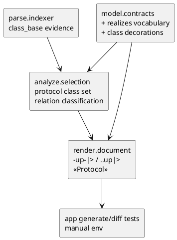

# iss-00030 Render Upward Inheritance And Protocol Realization — 設計（HOW）

## 既存実装 / 規約の理解
- `src/pyclassuml/model/contracts.py`
  - relation type は `inherits / association / uses` 固定。
- `src/pyclassuml/parse/indexer.py`
  - base class は `ClassReference(..., reference_kind="class_base", reference_owner="base")` として収集される。
- `src/pyclassuml/analyze/selection.py`
  - `class_base` を一律 `inherits` に分類する。
- `src/pyclassuml/render/document.py`
  - `inherits -> --|>`, `association -> -->`, `uses -> ..>` に変換する。

## 採用方針 / トレードオフ
- 採用:
  - relation type に `realizes` を追加する。
  - selected class が `Protocol` base を持つ場合、その class id を protocol class set として扱う。
  - base relation の target が protocol class set に含まれる場合、`realizes` に分類する。
  - Protocol class decoration は `class_decorations` に `("class_id", "Protocol")` を載せ、render で `<<Protocol>>` として出す。
- 不採用:
  - `ABC` / `@abstractmethod` の interface 判定。
  - field / method shape から interface を推測する heuristic。
  - render 側で `inherits` を Protocol かどうか再分類すること。

## Module Dependency Diagram


## インターフェース契約
- `RelationType`:
  - add: `realizes`
- `RenderReadyModel.class_decorations`:
  - existing pair `(ClassId, str)` を使用する。
  - value `"Protocol"` は PlantUML stereotype `<<Protocol>>` として出力する。
- relation arrows:
  - `inherits -> -up-|>`
  - `realizes -> ..up|>`
  - `association -> -->`
  - `uses -> ..>`

## ディレクトリ / ファイル変更計画
```text
.
|-- src/
|   `-- pyclassuml/
|       |-- model/contracts.py      # Modify: relation vocabulary
|       |-- analyze/selection.py    # Modify: protocol classification
|       `-- render/document.py      # Modify: arrow mapping and class decoration rendering
`-- tests/
    |-- model/test_contracts.py     # Modify/Add: realizes validation
    |-- analyze/test_selection.py   # Modify/Add: protocol realizes classification
    |-- render/test_document.py     # Modify/Add: upward arrows and Protocol stereotype
    `-- app/test_generate.py        # Modify/Add: generate E2E
```

## 要件 → 設計マッピング
- AC-001 -> render arrow mapping for `inherits`.
- AC-002 -> analyze `realizes` classification + render Protocol stereotype / arrow.
- AC-003 -> keep `uses` unchanged.
- AC-004 -> manual generate + SVG rendering evidence.
- EC-001 -> no ABC heuristic.
- EC-002 -> reuse existing resolution warning behavior.

## テスト戦略
- Unit:
  - relation validation accepts `realizes`.
  - analyze selects `realizes` when base target is a selected Protocol class.
  - render maps arrows and decorations.
- Integration:
  - generate E2E asserts `-up-|>` / `..up|>` / `<<Protocol>>`.
- Manual:
  - `build/manual-tests/pyclassuml-manual-env` の `retail_domain` を再生成し、`.puml` と `.svg` を確認する。
