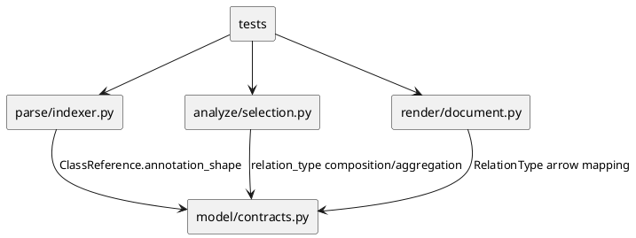

# iss-00032 Render Composition And Aggregation From Field Types — 設計（HOW）

## 目的・制約
- 目的:
  - field annotation 由来の selected internal class relation を、annotation shape に応じて `composition` / `aggregation` として扱い、PlantUML では owner 側 diamond 付き・矢印頭なし line として描画する。
- MUST / MUST NOT:
  - direct field type は composition。
  - Optional / Union / collection item / mapping value は aggregation。
  - mapping key は ownership target にしない。
  - method parameter / method return は ownership relation にしない。
  - import 実行、対象 source 書き換え、runtime ownership 推測は禁止。
- 非交渉制約:
  - AST-only、read-only、deterministic ordering。
  - 既存の inheritance `-up-|>`、Protocol realization `..up|>`、method-only uses `..>` を壊さない。

## 既存実装 / 規約の理解
- 参照した実装:
  - `src/pyclassuml/model/contracts.py`
  - `src/pyclassuml/parse/indexer.py`
  - `src/pyclassuml/analyze/selection.py`
  - `src/pyclassuml/render/document.py`
  - `tests/parse/test_module_parse_and_index.py`
  - `tests/analyze/test_selection.py`
  - `tests/render/test_document.py`
  - `tests/app/test_generate.py`
- 現状理解:
  - parser は `ParsedModule.class_references` に `ClassReference(source_class_id, target_name, reference_kind, reference_owner)` を出す。
  - field annotation は `reference_kind in {"field_annotation", "init_field_annotation"}` として analyzer に渡る。
  - analyzer は field annotation を `association`、method annotation を `uses`、class base を `inherits` / `realizes` に分類する。
  - render は `RelationType` から PlantUML arrow 文字列へ写像する。
- 現状の不足:
  - `ClassReference` は target 名と evidence kind は持つが、`Target` が direct field なのか、`list[Target]` / `dict[str, Target]` の内側なのかという wrapper shape を持たない。
  - 既存 semantic reference extraction は annotation 全体から class-like target を平坦化するため、mapping key と value の区別が消える。
- 採用するパターン:
  - parser で field annotation の target ごとに ownership shape を判定し、analyzer が relation type を決められる metadata を追加する。
  - relation vocabulary に `composition` / `aggregation` を追加し、既存 priority normalization に組み込む。
  - render は relation type のみを見て `*--` / `o--` を出す。
- 採用しないもの:
  - render 側で annotation text を再 parse して ownership を決めない。
  - runtime import / type introspection を使わない。
  - multiplicity / role label / field name label は追加しない。

## 採用方針 / トレードオフ
- 論点: ownership shape をどこで保持するか。
- 選択肢:
  - A: `ClassReference.reference_owner` に wrapper 情報を詰める。
  - B: `ClassReference` に optional field を追加する。
  - C: `ParsedModule` に `field_relation_shapes` のような side table を追加する。
- 決定:
  - B を採用する。`ClassReference` に `annotation_shape: str | None = None` を追加し、既存 call site は default `None` で互換を維持する。
- 理由:
  - relation selection に必要な情報が reference target と 1:1 で結びつく。
  - side table より lookup が単純で、test expectation も明確になる。
  - `reference_owner` は field name / method owner / base owner として既に意味を持っており、overload しない方が安全。

## Annotation Shape Contract
- `annotation_shape` は parser 由来の補助情報であり、runtime 型意味論ではない。
- 値:
  - `direct`: direct field type。例: `customer: Customer`、`Annotated[Customer, ...]`
  - `optional`: nullable optional。例: `coupon: Coupon | None`、`Optional[Coupon]`、`Union[Coupon, None]`
  - `union`: non-null union / choice。例: `source: Card | Invoice`、`Union[Card, Invoice]`
  - `collection`: collection item。例: `list[OrderLine]`、`set[OrderLine]`、`tuple[OrderLine, ...]`、`Sequence[OrderLine]`
  - `mapping_value`: mapping value。例: `dict[str, Item]`、`Mapping[str, Item]`、`MutableMapping[str, Item]`
- shape -> relation:
  - `direct` -> `composition`
  - `optional` / `union` / `collection` / `mapping_value` -> `aggregation`
  - `None` -> 既存規則。field annotation なら backward-compatible fallback として `association`。
- mapping rule:
  - `dict[Key, Value]` / `Mapping[Key, Value]` は value 側だけを `mapping_value` として ownership target にする。
  - key 側 target は ownership relation にしない。key 側は semantic ownership extraction から除外し、key が unresolved でも warning を必須にしない。
- wrapper rule:
  - `Annotated[T, ...]` は wrapper を剥がして内側を分類する。
  - `ClassVar[T]` / `Final[T]` / `Required[T]` / `NotRequired[T]` は directness を変えない透明 wrapper として扱う。
  - `Literal[...]` は ownership target を出さない。
- nested rule:
  - classification は annotation AST を recursive に辿る。
  - `Optional[list[Target]]`、`Annotated[list[Target], ...]`、`dict[str, list[Target]]` は内側 target を `aggregation` とする。
  - directness は wrapper の中で weaker ownership が一度でも出たら aggregation に落とす。つまり collection / mapping / union / optional の内側 target は `direct` へ戻さない。

## Module Dependency Diagram


## インターフェース契約
- `ClassReference`:
  - `annotation_shape: str | None = None` を追加する。
  - 許可値は `direct | optional | union | collection | mapping_value | None`。
  - `annotation_shape` が非 `None` の場合、`reference_kind` は原則 `field_annotation` / `init_field_annotation`。
- `RelationType`:
  - `composition` / `aggregation` を追加する。
  - endpoint 単位の優先順位は `inherits` / `realizes` を最上位に維持し、続いて `composition`、`aggregation`、`association`、`uses` とする。
  - 同じ endpoint に direct field と optional / collection / mapping field が併存する場合は `composition` を優先する。
  - render mapping:
    - `composition` -> `*--`
    - `aggregation` -> `o--`
    - `inherits` -> `-up-|>`
    - `realizes` -> `..up|>`
    - `association` -> `-->`
    - `uses` -> `..>`

## ディレクトリ / ファイル変更計画
```text
.
|-- src/
|   `-- pyclassuml/
|       |-- model/contracts.py          # Modify: ClassReference validation and relation vocabulary
|       |-- parse/indexer.py            # Modify: field/init field annotation shape extraction
|       |-- analyze/selection.py        # Modify: shape -> composition/aggregation classification and priority
|       `-- render/document.py          # Modify: PlantUML diamond line rendering
`-- tests/
    |-- model/test_contracts.py         # Modify: new relation types and annotation_shape validation
    |-- parse/test_module_parse_and_index.py # Modify: direct/optional/union/collection/mapping shape coverage
    |-- analyze/test_selection.py       # Modify: relation classification and priority coverage
    |-- render/test_document.py         # Modify: *-- / o-- output coverage
    `-- app/test_generate.py            # Modify: E2E coverage and regression for inheritance/realization
```

## 要件 → 設計マッピング
- AC-001:
  - `annotation_shape=direct` -> `composition` -> `*--`
- AC-002:
  - `annotation_shape=optional` -> `aggregation` -> `o--`
- AC-003:
  - `annotation_shape=collection` -> `aggregation` -> `o--`
- AC-004:
  - `annotation_shape=union` targets -> each `aggregation`
- AC-005:
  - `annotation_shape=mapping_value` -> `aggregation`
- AC-006:
  - mapping key is not emitted as ownership semantic field reference and does not require unresolved warning
- AC-007:
  - method references keep `uses`
- AC-008:
  - existing inheritance / realization render mapping unchanged
- EC-001 / EC-004:
  - unresolved selected target handling remains analyzer diagnostics
- EC-002:
  - relation normalization dedupes same endpoint/type
- EC-003:
  - relation priority prefers composition over aggregation
- EC-005:
  - mapping key unresolved does not create ownership and does not block value aggregation
- EC-006:
  - nested wrapper item/value target remains aggregation

## テスト戦略
- Unit:
  - model validation for new relation types and annotation shapes.
  - parse shape extraction for direct, Optional, PEP 604 union, `typing.Union`, collection, mapping value, mapping key exclusion, `Annotated`, nested wrappers.
  - analyze classification and priority: composition > aggregation > association > uses; method-only stays uses.
  - render arrows: `*--`, `o--`, no `*-->` / `o-->`.
- Integration:
  - generate E2E fixture including Pydantic `BaseModel` fields and normal domain fields.
- Manual:
  - `build/manual-tests/pyclassuml-manual-env` の複雑 sample を disposable copy で拡張し、composition / aggregation / mapping value / inheritance / Protocol realization を同じ `.puml` と `.svg` で確認する。

## リスク / ロールバック
- リスク:
  - `ClassReference` に field を追加すると既存 tests の equality expectations に影響する。
  - parser が semantic target を平坦化しているため、mapping key exclusion を明示的に test しないと false positive しやすい。
  - nested wrapper は recursive extraction が必要なため、unknown typing constructs は既存 diagnostics 方針で recoverable に扱う。
  - relation priority を誤ると inheritance / field ownership / method uses が重複または逆転する。
- ロールバック:
  - `composition` / `aggregation` relation vocabulary と parser shape extraction を revert すれば既存 association 表現へ戻せる。

## 未確定事項
- 該当なし。
