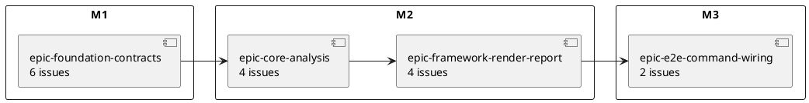
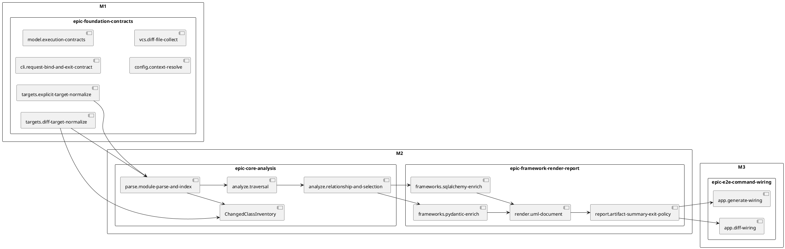
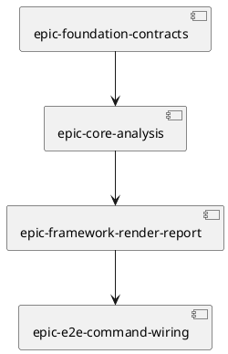

# init-00001 PyClassUML Prototype — 計画（Roadmap / Epics / Sequencing）

## この文書の責務
- この `plan.md` は、initiative における **epic grouping / milestone / issue baseline / execution order** の正本とする。
- WHAT / acceptance は `requirement.md` を優先し、whole-system boundary と guardrail は `design.md` を優先する。
- seam-level HOW、DTO handoff、stage contract の詳細は `20260416t113919z-note-pyclassuml-architecture-v5.md` を優先する。
- summary 図やポートフォリオ表は navigational aid であり、owner / upstream dependency / completion contract / canonical verification の authoritative source は本書の `Issue baseline table` とする。

## この計画が達成する Goal / Metric
- Goal:
  - `pyclassuml` prototype を、seam-first で実装可能な epic / issue ポートフォリオに分解できる状態にする。
- 対象 metric:
  - requirement / design / v5 / ADR に整合した epic grouping がある。
  - 4 epics / 16 issues の配置理由、依存順、milestone exit が一意に説明できる。
  - initiative pass 後に、対象 epic / issue の spec-review pass を前提として実装着手できる gate 条件が明文化されている。

## Execution Gate
- initiative-level pass は whole-system の投資判断と分解正当性を承認する gate であり、これ単独では任意の issue 実装開始を自動承認しない。
- 実装開始の最低条件は次とする。
  - initiative `requirement.md` / `design.md` / `plan.md` が spec-review pass である。
  - 対象 epic の `requirement.md` / `design.md` / `plan.md` が spec-review pass である。
  - 対象 issue の `requirement.md` / `design.md` が spec-review pass である。
  - 対象 issue の `plan.md` は execution 直前に具体化する。
- issue `plan.md` は implementation 開始前に必須だが、initiative gate 上は spec-review pass の必須対象ではなく、issue execution turn で concrete task / verification checklist として更新する non-gating artifact とする。
- したがって initiative pass の意味は、「whole-system boundary と epic / issue decomposition が承認され、下位 spec-review pass を前提に execution へ降ろせる状態」である。

## Portfolio Snapshot

### 4 epics / 16 issues / 3 milestones
| milestone | epic | issues | 主対象 seam | この分け方の意図 |
| --- | --- | --- | --- | --- |
| `M1` | `epic-foundation-contracts` | 6 | `cli`, `model`, `config`, `targets`, `vcs` | path semantics、config、explicit/diff seed、usage/exit を前段 1 つに束ねる |
| `M2` | `epic-core-analysis` | 4 | `parse`, `analyze` | AST-only の中核推論を独立した価値塊として固める |
| `M2` | `epic-framework-render-report` | 4 | `frameworks`, `render`, `report` | enrich と output policy を downstream 責務として成立させる |
| `M3` | `epic-e2e-command-wiring` | 2 | `app` | `app` を最後の stitcher に限定して end-to-end を閉じる |

### roadmap overview

読み方:
- M1 は前段契約固定、M2 は解析核と downstream 出力責務の固定、M3 は command としての stitching で閉じる。
- `generate` / `diff` の差分は M1 までに閉じ、M2 以降へ command-specific branching を漏らさない。

## Why This Split
- `foundation` を 1 epic に束ねるのは、`execution_cwd / project_root / package_root / scope_root`、config merge、explicit target、diff seed semantics を別 epic に裂かないためである。
- `core-analysis` を独立させるのは、AST-only の価値核を framework support や output policy と混ぜずに確定するためである。
- `framework-render-report` を 1 epic に束ねるのは、best-effort enrich と deterministic output / summary / exit policy を downstream の責務として閉じるためである。
- `e2e-command-wiring` を最後に分けるのは、`app` を orchestration 以上の責務から守り、patchwork 的な cross-layer 調整レイヤ化を防ぐためである。
- 3 epics では粗すぎ、5 epics 以上では prototype 規模に対して governance コストが過剰になるため、4 epics が最もバランスがよい。

## Seam -> Epic -> Milestone Mapping

読み方:
- seam は `foundation -> core-analysis -> downstream output -> e2e wiring` の順で積み上げる。
- `ChangedClassInventory` は `analyze` 配下に置くことで、到達可否と changed file semantics を切り分ける。
- `render` と `report` は M2 で確定させ、M3 で `app` がそれらを stitch するだけに留める。

## Epic Dependency Sequence

### sequencing rationale
- foundation を先に固定しないと、後段の parse / analyze acceptance が path semantics や config 解釈差に引きずられる。
- CLI request bind と exit contract を foundation に含めることで、`app` と `report` への責務流出を防ぐ。
- core analysis を先に固めることで、`frameworks` / `render` / `report` を pure downstream に保てる。
- `app` は最後に wiring することで、cross-layer stitching を最小化し、実装途中の暫定ロジック流入を抑える。

## Milestone Plan
| milestone | closes when | included epics | exit focus | sequencing reason |
| --- | --- | --- | --- | --- |
| `M1` | `epic-foundation-contracts` 完了 | `epic-foundation-contracts` | 4 roots、config merge、explicit/diff target normalization、usage/exit の前段契約が固定されている | 後段 acceptance の前提をここで凍結する |
| `M2` | `epic-core-analysis` と `epic-framework-render-report` 完了 | `epic-core-analysis`, `epic-framework-render-report` | AST-only の中核推論、framework best-effort、deterministic render、summary / exit policy が固定されている | 製品価値の核と downstream output を `app` から独立に成立させる |
| `M3` | `epic-e2e-command-wiring` 完了 | `epic-e2e-command-wiring` | `generate` / `diff` の end-to-end artifact / summary / exit code が要求どおり観測できる | 最後に stitch して command として閉じる |

### milestone exit seams
- `M1` exit seams:
  - `cli.request-bind-and-exit-contract`
  - `model.execution-contracts`
  - `config.context-resolve`
  - `targets.explicit-target-normalize`
  - `vcs.diff-file-collect`
  - `targets.diff-target-normalize`
- `M2` exit seams:
  - `parse.module-parse-and-index`
  - `analyze.traversal`
  - `analyze.relationship-and-selection`
  - `ChangedClassInventory`
  - `frameworks.sqlalchemy-enrich`
  - `frameworks.pydantic-enrich`
  - `render.uml-document`
  - `report.artifact-summary-exit-policy`
- `M3` exit seams:
  - `app.generate-wiring`
  - `app.diff-wiring`

## Epic Summary
| epic | issues | upstream dependency | seam owner | 完了時に固定されるもの |
| --- | --- | --- | --- | --- |
| `epic-foundation-contracts` | 6 | none | `cli`, `model`, `config`, `targets`, `vcs` | root 境界、config discovery / merge、explicit / diff seed 契約、前段の failure taxonomy |
| `epic-core-analysis` | 4 | `epic-foundation-contracts` | `parse`, `analyze` | syntax degradation、depth / scope traversal、relation-based selection、changed class semantics |
| `epic-framework-render-report` | 4 | `epic-core-analysis` | `frameworks`, `render`, `report` | framework best-effort の下限、deterministic PlantUML、summary / stream / exit policy |
| `epic-e2e-command-wiring` | 2 | `epic-framework-render-report` | `app` | `generate` / `diff` end-to-end、current-state / untracked の user-visible 差 |

## Issue Allocation Summary
- `1 issue = 1 seam` を initiative の標準分解単位とする。
- 下の要約表は配置の見取り図であり、canonical な依存 / owner / completion / verification は後段の `Issue baseline table` を参照する。

### `epic-foundation-contracts` — 6 issues
| issue | 1 行要約 |
| --- | --- |
| `cli.request-bind-and-exit-contract` | argv parse、`--cwd` bind、usage error、exit code propagation を固定する |
| `model.execution-contracts` | `CommandRequest` を含む stage 間 DTO と invariant を固定する |
| `config.context-resolve` | `process_cwd` からの `execution_cwd` resolve、4 roots、config merge、relative path semantics、config failure を固定する |
| `targets.explicit-target-normalize` | file / glob / dir 起点と ignore 適用を固定する |
| `vcs.diff-file-collect` | `--base`、`working-tree|head`、untracked、VCS failure を固定する |
| `targets.diff-target-normalize` | diff seed の scope filtering と zero-target fail を固定する |

### `epic-core-analysis` — 4 issues
| issue | 1 行要約 |
| --- | --- |
| `parse.module-parse-and-index` | import 非実行 AST parse と dependency candidate ignore を固定する |
| `analyze.traversal` | depth / package / scope 境界つき reachability を固定する |
| `analyze.relationship-and-selection` | relation extraction と UML class selection を固定する |
| `ChangedClassInventory` | changed class 数の集計 semantics を固定する |

### `epic-framework-render-report` — 4 issues
| issue | 1 行要約 |
| --- | --- |
| `frameworks.sqlalchemy-enrich` | `Mapped[T]` と `relationship("T")` の best-effort を固定する |
| `frameworks.pydantic-enrich` | forward reference の best-effort enrich を固定する |
| `render.uml-document` | deterministic PlantUML text を固定する |
| `report.artifact-summary-exit-policy` | `.puml` artifact、summary、stream routing、failure taxonomy を固定する |

### `epic-e2e-command-wiring` — 2 issues
| issue | 1 行要約 |
| --- | --- |
| `app.generate-wiring` | `generate` の end-to-end 実行を成立させる |
| `app.diff-wiring` | `diff` の end-to-end 実行を成立させる |

## Issue baseline table
- この表を、issue の `upstream` / `owner` / `observable behavior` / `completion contract` / `canonical verification` の canonical source とする。
- bridge 的な説明や図はこの表を上書きしない。

| issue baseline | epic | upstream | owner | observable behavior | completion contract | canonical verification |
| --- | --- | --- | --- | --- | --- | --- |
| `cli.request-bind-and-exit-contract` | `epic-foundation-contracts` | `model.execution-contracts` | `cli` | usage error / `--cwd` bind / exit propagation | argv parse、`--cwd` を含む CLI option bind、usage error、`cli_usage_error`、exit code propagation を固定する | usage error で `cli_usage_error` を持つ non-zero summary が返り、`--cwd` 指定が `CommandRequest` へ引き渡され、exit code propagation が観測できる |
| `model.execution-contracts` | `epic-foundation-contracts` | none | `model` | dto field / invariant | `CommandRequest(process_cwd, cli_options.command, cli_options.cwd, cli_options.config, cli_options.project_root, cli_options.package_root, cli_options.scope_root, cli_options.output, cli_options.ignore, cli_options.depth, cli_options.strict, cli_options.target_python, cli_options.generate.targets, cli_options.diff.base_ref, cli_options.diff.current_state, cli_options.diff.include_untracked)`, `ExecutionContext(execution_cwd, project_root, package_root, scope_root)`, `AnalysisConfig(ignore, output, depth, mode, target_python, diff.current_state, diff.include_untracked)` where `depth = null | int >= 0`, `mode = warn | strict`, and `target_python = null | 3.<minor>`, `TargetObservations(ignored_seed_candidate_count, diff_scope_excluded_count)`, `TargetSet(seed_files, observations)` where `seed_files` are Python source files only, `ParsedModule(module_path, imports, classes, diagnostics)`, `DependencyGraph(reachable_files, edges)`, `SelectedClasses(class_ids)`, `ChangedClassInventory(class_count, changed_files)`, `RenderReadyModel(classes, members, relations, class_decorations, grouping_keys, diagnostics)`, `DiagramModel(containers, rendered_classes, rendered_relations, aliases)`, `PlantUmlText(text)`, `Diagnostic(severity, code, message, origin_seam, recoverability, failure_reason?)` where failure diagnostic では `failure_reason` 必須、warning-only diagnostic では `null`, `RunSummary(counters, failure_reason)`, `CommandResult(artifact_path, summary, diagnostics, exit_code)` の最小 field / invariant を固定する | 各 DTO の必須 field、nullability、`process_cwd -> execution_cwd` handoff、`cli_options` canonical schema、`depth = null | int >= 0` の command-neutral carry、`mode=warn|strict`、`target_python = null | 3.<minor>` の carry と downstream purpose、Python source 限定の `TargetSet.seed_files`、`TargetObservations` の counter carry、usage error のときだけ CLI が `RunSummary` / `CommandResult` を synthesize し、それ以外は `report` が生成する producer rule、`CommandResult.exit_code=0` なら `cli` は stdout、non-zero なら stderr に summary / diagnostics を書く stream-routing invariant、`app.*-wiring` が original `TargetSet.observations` を `report` へ handoff する transport path、graph/class-selection/relation handoff、render-ready grouping/decorations、diagram alias/container handoff、plantuml text handoff、diagnostic severity/recoverability/failure_reason nullability rule、summary/failure_reason、artifact/summary/exit_code handoff が review できる |
| `config.context-resolve` | `epic-foundation-contracts` | `model.execution-contracts` | `config` | 4 root resolve / `--cwd` handoff / config merge / invalid config fail-fast / config discovery | 4 root resolve、`process_cwd` 基準の `--cwd` resolve、`cli_options.command` / `cli_options.target_python` / `cli_options.diff.current_state` / `cli_options.diff.include_untracked` を含む request consume、CLI > config > default priority、`mode=warn|strict` への写像、`target_python` の semantic validation / carry、未指定時 `null`、`project_root` は CLI > config > config-file-dir > `execution_cwd`、`package_root` 未指定時は `project_root`、`scope_root` 未指定時は `package_root`、`--config` 指定時読込、`--project-root` 優先探索、`execution_cwd` 親探索、`relative_path_base=config|cwd`、config-file-dir fallback project_root、config read failure、invalid config value、unresolved config path、containment fail-fast を固定する | `process_cwd` 基準の `--cwd` resolve、4 roots の default derivation order、`mode=warn|strict` mapping、`target_python` validation / carry / nullability、config-file-dir fallback project_root、invalid containment、config merge priority、config auto-discovery order、config read failure、invalid config value、unresolved config path が hard failure として観測できる |
| `targets.explicit-target-normalize` | `epic-foundation-contracts` | `config.context-resolve` | `targets` | explicit target normalization / ignore application | explicit target 正規化、dedupe、scope outside fail、`generate_zero_target_after_normalize` を使う zero-seed hard failure、`project_root` 相対 ignore、default ignore 適用を固定する | file + glob + dir input、dedupe、scope outside fail、glob miss / all ignored による `generate_zero_target_after_normalize` hard failure、default ignore / user ignore 反映が観測できる |
| `vcs.diff-file-collect` | `epic-foundation-contracts` | `model.execution-contracts`, `config.context-resolve` | `vcs` | diff current-state / untracked / VCS read failure | `--base <ref>`、current-state、untracked、VCS read failure を固定する | `working-tree` / `head`、untracked on/off、invalid `--base <ref>`、Git diff read failure が観測できる |
| `targets.diff-target-normalize` | `epic-foundation-contracts` | `config.context-resolve`, `vcs.diff-file-collect` | `targets` | diff seed normalization | diff seed 正規化、`project_root` 相対 ignore / default ignore 適用、scope outside exclusion、zero-target fail を固定する | ignore 反映、scope outside exclusion、zero-target fail が観測できる |
| `parse.module-parse-and-index` | `epic-core-analysis` | `targets.explicit-target-normalize`, `targets.diff-target-normalize`, `config.context-resolve` | `parse` | syntax degradation / import non-exec / dependency-candidate ignore application | import 非実行、syntax diagnostics、parsed module index、依存探索中に発見された candidate file への `project_root` 相対 ignore / default ignore 適用を固定する | `fx-parse-syntax-error` と `fx-parse-ignored-dependency-candidate` で discard 範囲と ignore 指定された dependency candidate の除外が観測できる |
| `analyze.traversal` | `epic-core-analysis` | `parse.module-parse-and-index` | `analyze` | traversal boundaries | seed provenance を保持したまま depth / package / scope 境界つき reachability を固定し、`traversal_limit_reached` を `analyze` owner error にする | `fx-traversal-depth-matrix`, `fx-traversal-package-boundary`, `fx-traversal-scope-stop`, `fx-traversal-limit-reached` が観測できる |
| `analyze.relationship-and-selection` | `epic-core-analysis` | `parse.module-parse-and-index`, `analyze.traversal` | `analyze` | relation extraction / class selection | relation 抽出、起点ファイル全表示、accepted relation endpoint のみを依存先クラスとして選別し、downstream `report` が再集計なしで使える extracted class / relation counter と warning diagnostics の carry を固定する | `fx-analyze-seed-full-display` / `fx-analyze-changed-unreachable` / `fx-analyze-relation-only-dependency` / `fx-analyze-relation-ambiguity` が観測できる |
| `ChangedClassInventory` | `epic-core-analysis` | `parse.module-parse-and-index`, `targets.diff-target-normalize` | `analyze` | changed class summary semantics | changed file 集合と parsed class 定義だけを source にした changed class summary semantics を固定する | `fx-analyze-changed-unreachable` / `fx-analyze-changed-file-without-class` / `fx-analyze-changed-syntax-error-join-miss` で changed class 数が観測できる |
| `frameworks.sqlalchemy-enrich` | `epic-framework-render-report` | `analyze.relationship-and-selection`, `parse.module-parse-and-index` | `frameworks` | SQLAlchemy best-effort enrich | SQLAlchemy best-effort enrich を固定する | `fx-framework-sqlalchemy-basic` で relation 追加または warning が観測できる |
| `frameworks.pydantic-enrich` | `epic-framework-render-report` | `analyze.relationship-and-selection`, `parse.module-parse-and-index` | `frameworks` | Pydantic best-effort enrich | Pydantic best-effort enrich を固定する | `fx-framework-pydantic-forward-ref` で relation 追加または warning が観測できる |
| `render.uml-document` | `epic-framework-render-report` | `parse.module-parse-and-index`, `analyze.relationship-and-selection`, `frameworks.sqlalchemy-enrich`, `frameworks.pydantic-enrich` | `render` | deterministic PlantUML output | parse/analyze handoff と framework hints から `RenderReadyModel` を合成し、deterministic PlantUML text を固定する | stable order / grouping / labels と render failure handoff が観測できる |
| `report.artifact-summary-exit-policy` | `epic-framework-render-report` | `render.uml-document`, `config.context-resolve`, `vcs.diff-file-collect`, `parse.module-parse-and-index`, `analyze.traversal`, `analyze.relationship-and-selection`, `ChangedClassInventory`, `frameworks.sqlalchemy-enrich`, `frameworks.pydantic-enrich`, `targets.explicit-target-normalize`, `targets.diff-target-normalize` | `report` | `.puml` write / summary / failure taxonomy / output naming | `.puml` filesystem write、`--output` の `execution_cwd` 基準解決、自動命名、衝突時 suffix、summary stream routing、failure taxonomy、strict / warn policy を固定する | summary counters、`diagram_unbuildable_after_recovery`、`traversal_limit_reached`、`output_write_failure`、auto naming、suffix collision、stdout/stderr routing が観測できる |
| `app.generate-wiring` | `epic-e2e-command-wiring` | `cli.request-bind-and-exit-contract`, `model.execution-contracts`, `config.context-resolve`, `targets.explicit-target-normalize`, `parse.module-parse-and-index`, `analyze.traversal`, `analyze.relationship-and-selection`, `ChangedClassInventory`, `frameworks.sqlalchemy-enrich`, `frameworks.pydantic-enrich`, `render.uml-document`, `report.artifact-summary-exit-policy` | `app` | e2e generate | generate e2e を固定する | `.puml` filesystem artifact、stdout summary、exit code、auto naming / `--output` path resolution が観測できる |
| `app.diff-wiring` | `epic-e2e-command-wiring` | `cli.request-bind-and-exit-contract`, `model.execution-contracts`, `config.context-resolve`, `vcs.diff-file-collect`, `targets.diff-target-normalize`, `parse.module-parse-and-index`, `analyze.traversal`, `analyze.relationship-and-selection`, `ChangedClassInventory`, `frameworks.sqlalchemy-enrich`, `frameworks.pydantic-enrich`, `render.uml-document`, `report.artifact-summary-exit-policy` | `app` | e2e diff | diff e2e を固定する | `.puml` filesystem artifact、summary stream、exit code、current-state / untracked switch、auto naming / `--output` path resolution が観測できる |

## Parallelism And Execution Notes
- foundation 内では `model.execution-contracts` と `vcs.diff-file-collect` は並行検討しやすいが、`config.context-resolve` が固まる前に target semantics を実装確定しない。
- `frameworks.sqlalchemy-enrich` と `frameworks.pydantic-enrich` は `analyze.relationship-and-selection` 完了後であれば並列化しやすい。
- `render.uml-document` は framework enrich の downstream とするが、strict/warn の最終判定は `report` に残す。
- `app.generate-wiring` と `app.diff-wiring` は同一 epic に置くが、共通 pipeline を崩さない前提で分離実装してよい。

## 意思決定ゲート
- `G1 strategy review`:
  - architecture v5 と initiative requirement / design / plan が整合している。
- `G2 milestone readiness`:
  - M1 で前段契約が固定され、epic issue 切りが可能になっている。
- `G3 governance/docs impact`:
  - scope / boundary / strict 最小集合の正本が docs 間で一致している。
- `G9 final initiative plan review`:
  - epic grouping、milestone、dependency order が review で pass している。

## 指標レビュー計画
- review timing:
  - canonical docs 昇格反映後
  - epic portfolio 確定時
  - final initiative plan review 時
- dashboard / source:
  - `requirement.md`
  - `design.md`
  - `plan.md`
  - `20260416t113919z-note-pyclassuml-architecture-v5.md`
  - `adr/20260416t121500z-adr-v5-ratification.md`

## verification fixture ids
- canonical source:
  - verification fixture の canonical source は `tests/fixtures/sample_projects/` 配下とする。
- ownership:
  - 各 fixture は、その fixture を最初に必要とする issue baseline の owner が作成責任を持つ。
- usage rule:
  - fixture が定義されている seam / milestone は、ここで定義した fixture ID と canonical source を前提に評価する。
  - fixture 未定義の seam / milestone は、CLI invocation transcript、config discovery scenario、stdout/stderr capture、artifact filesystem observation を canonical evidence として扱ってよい。
- non-fixture canonical evidence:
  - `cli.request-bind-and-exit-contract`, `config.context-resolve`, `targets.explicit-target-normalize`, `vcs.diff-file-collect`, `targets.diff-target-normalize`, `render.uml-document`, `report.artifact-summary-exit-policy`, `app.generate-wiring`, `app.diff-wiring` は fixture だけでなく command transcript と filesystem / stream observation を canonical evidence に使える。
- `fx-parse-syntax-error`
  - syntax error を含む module を解析し、discard 範囲と diagnostics を確認する。
- owner:
  - `parse.module-parse-and-index`
- `fx-parse-ignored-dependency-candidate`
  - ignore 指定された dependency candidate が graph 候補から除外され、ignore 件数材料が carry されることを確認する。
- owner:
  - `parse.module-parse-and-index`
- `fx-traversal-depth-matrix`
  - depth=0 と depth=1 で reachable set が変わることを確認する。
- owner:
  - `analyze.traversal`
- `fx-traversal-package-boundary`
  - `package_root` 外 candidate が frontier に入らないことを確認する。
- owner:
  - `analyze.traversal`
- `fx-traversal-scope-stop`
  - `scope_root` 外 candidate が frontier 拡張に使われず scope stop が記録されることを確認する。
- owner:
  - `analyze.traversal`
- `fx-traversal-limit-reached`
  - 探索上限到達が `traversal_limit_reached` として観測されることを確認する。
- owner:
  - `analyze.traversal`
- `fx-analyze-changed-unreachable`
  - changed file に class があるが到達 graph に乗らないケースで changed class semantics を確認する。
- owner:
  - `analyze.relationship-and-selection` / `ChangedClassInventory`
- `fx-analyze-relation-only-dependency`
  - relation が検出された依存先 class だけが表示対象になることを確認する。
- owner:
  - `analyze.relationship-and-selection`
- `fx-analyze-relation-ambiguity`
  - relation ambiguity 時に `SelectionObservations.warning_diagnostics` と extracted class / relation counter が `report` へ carry されることを確認する。
- owner:
  - `analyze.relationship-and-selection`
- `fx-analyze-changed-file-without-class`
  - class 定義を持たない changed file が `changed_files` には含まれ、`class_count` は増えないことを確認する。
- owner:
  - `ChangedClassInventory`
- `fx-framework-sqlalchemy-basic`
  - `Mapped[T]` と `relationship("T")` の best-effort enrich を確認する。
- owner:
  - `frameworks.sqlalchemy-enrich`
- `fx-framework-pydantic-forward-ref`
  - forward reference による relation enrich を確認する。
- owner:
  - `frameworks.pydantic-enrich`

## ロールアウト計画
- rollout window:
  - prototype initiative 内で M1 -> M2 -> M3 の順に段階実装する。
- release / communication:
  - internal CLI prototype として扱う。

## Epic readiness contract
- Epic に要求する最低条件:
  - seam owner が 1 つに定まっている。
  - upstream dependency が明示されている。
  - observable behavior と canonical verification case が定義されている。
  - `generate` / `diff` 差分が前段に閉じている。
  - issue baseline が `1 issue = 1 seam` 原則を壊していない。

## final exit contract
- milestone exit:
  - M1 / M2 / M3 の deliverable と exit 条件を満たす。
- success metrics reviewed:
  - Metric-001 と Metric-002 を review する。
- remaining follow-up ownership:
  - 実装そのものは後続の epic / issue execution へ送る。
  - MVP 外項目は将来拡張として別 initiative / epic へ送る。

## 依存 / リスク
- `D-001`:
  - initiative 正本 docs と v5 / ADR の不整合。
- `D-002`:
  - strict 最小集合や diff switch ownership が曖昧なまま実装へ入ること。
- `D-003`:
  - `foundation` を分割し過ぎて path semantics と config / diff semantics が二重管理になること。
- `D-004`:
  - `render` / `report` / `app` の責務境界が崩れ、`app` が調整レイヤになること。

## 未確定事項
- `Q-001`:
  - 質問:
    - なし。initiative planning としては着手可能な粒度まで固定する。
  - 選択肢:
    - A:
      - n/a
    - B:
      - n/a
  - 推奨案:
    - 残論点は epic / issue planning と execution へ送る。
  - 影響範囲:
    - execution phase
