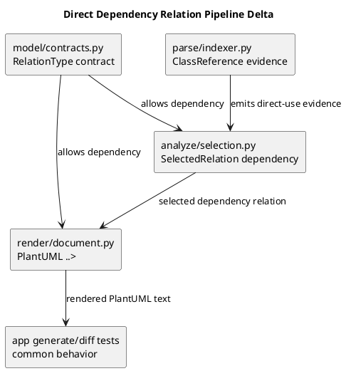

# iss-00040 Render Direct Class Dependency — 設計（HOW）

## 親 Diagram 参照
- Epic diagram:
  - N/A: この epic は軽微な bugfix epic であり、共有 architecture diagram はまだ持たない。
- Initiative diagram:
  - N/A: この initiative は直接依存表示 bugfix の作業単位であり、Issue-level の局所設計で閉じる。
- 再利用する決定:
  - `requirement.md` で固定した一般 UML 方針を採用する。Runtime direct use は association ではなく dependency とし、PlantUML では `..>` として描画する。
  - `discussions/20260522t084855z-research-direct-dependency-relation-investigation.md` の再現結果を defect source とする。
  - `discussions/20260522t090118z-interview-direct-dependency-requirement-interview.md` の deep-consultant proxy answers を relation semantics の根拠とする。

## 目的・制約
- 目的:
  - `ClassReference` 抽出対象を method body の direct class use へ広げ、selection で `dependency` relation に変換する。
  - 明示 import / alias import / relative import / module-qualified access を、import-only edge ではなく direct-use target resolution の材料として使う。
  - `generate` / `diff` の共通 parse/analyze/render 経路で同じ dependency relation を出す。
- 必須 / 禁止:
  - 必須: `dependency` relation type を内部 model / selection / render に追加する。
  - 必須: `B()`, `return B()`, `B.factory()`, `module.B()`, `isinstance`, `issubclass`, `typing.cast`, local annotation, `self.b = B()` を class symbol に一意解決できる範囲で evidence 化する。
  - 禁止: runtime direct use を `association` として扱うこと。
  - 禁止: import 文だけで relation を出すこと。
  - 禁止: 曖昧な参照を推測して edge にすること。
- 非交渉制約:
  - AST ベース静的解析、対象 code 非 import 実行、読み取り専用、決定性を維持する。
  - 既存 typed field / method annotation / inheritance / framework hint の semantics を壊さない。
- 前提:
  - `ParsedModule.class_references` は parse seam から analyze seam へ relation evidence を渡す既存 SoR である。
  - `ModuleIndex.import_candidate_paths` は import text から project-relative target module を引ける既存材料である。
  - `SelectedRelation.relation_type` は model contract で許可値を制限しているため、`dependency` 追加は model / render / tests の contract 変更を伴う。

## 既存実装 / 規約の理解
- 参照した実装 / docs:
  - `src/pyclassuml/model/contracts.py`
    - `_RELATION_TYPES`, `_ensure_relation_type`, `SelectedRelation`, `RenderReadyModel`, `DiagramModel`
  - `src/pyclassuml/parse/indexer.py`
    - `_class_body_references()`, `_method_annotation_references()`, `_walk_without_nested_definition_bodies()`, `_extract_import_refs()`
  - `src/pyclassuml/analyze/selection.py`
    - `_RELATION_TYPE_PRIORITY`, `_EVIDENCE_KIND_PRIORITY`, `_relation_type_for_reference()`, `_target_candidates()`, `_normalize_relations()`
  - `src/pyclassuml/render/document.py`
    - `_relation_arrow()`
  - `tests/parse/test_module_parse_and_index.py`, `tests/analyze/test_selection.py`, `tests/render/test_document.py`, `tests/app/test_generate.py`, `tests/app/test_diff.py`
- 現状理解:
  - Parse は class base、field annotation、method parameter / return annotation、`__init__` parameter-derived field annotation、class body の annotation / string hint を拾う。
  - 通常 method body では annotation と `__init__` field annotation 以外を relation evidence にしない。
  - Selection は typed relation target が未選択 class の場合に `typed_relation_selection_outside` warning として relation を作らない。
  - Module import fallback は source / target module がともに 1 class の場合のみ `uses` relation を作る。
  - Render は既存 relation type を PlantUML arrow へ写像するが、`dependency` は未定義である。
- 採用するパターン:
  - New evidence kind を `ClassReference.reference_kind` に追加し、selection で relation type へ変換する既存 seam を維持する。
  - `_walk_without_nested_definition_bodies()` を使い、nested class / function / lambda body を outer class relation に混ぜない既存方針を維持する。
  - Relation normalization は endpoint ごとに高優先 relation を 1 本に絞る既存方針を維持する。
- 採用しないもの:
  - Python import / symbol resolution の完全実装。
  - Data-flow tracking や factory return type inference。
  - 既存 `uses` relation の意味変更。
  - `association` / `composition` / `aggregation` の推定拡張。
- 影響範囲:
  - Model contract、parse class reference extraction、selection relation classification / target resolution、render mapping、generate / diff app behavior、targeted tests。

## 採用方針 / トレードオフ
- 論点:
  - Runtime direct use を既存 `association` に寄せるか、新 `dependency` として扱うか。
- 選択肢:
  - A: `association` を流用して `-->` を出す。
  - B: `dependency` を新設して `..>` を出す。
- 決定:
  - B を採用する。
  - UML 第一原理では、method body の生成・呼び出し・型確認は client が supplier に依存する関係であり、instance 間の構造 link である association ではない。
  - `association` と混ぜないことで、将来 association 推定を追加したときの precedence / filtering / diff identity が保ちやすい。

### Evidence Kind 方針

| evidence kind | 入力例 | relation type | 備考 |
|---|---|---|---|
| `direct_class_call` | `B()`, `return B()`, `x = B()`, `self.b = B()` | `dependency` | Constructor-like runtime use |
| `direct_class_member_access` | `B.factory()`, `B.CONST`, `module.B.factory()` | `dependency` | class object / class-level access |
| `type_check_dependency` | `isinstance(x, B)`, `issubclass(x, B)` | `dependency` | runtime type/specification dependency |
| `cast_dependency` | `typing.cast(B, x)`, `cast(B, x)` | `dependency` | specification dependency |
| `local_annotation_dependency` | `x: B` in method body | `dependency` | local type/specification dependency |

### Target Resolution 方針

- Same-module class は short name で一意解決する。
- Fully/module-qualified name は既存 `_module_qualified_target_candidates()` を使う。
- `from target import B` / `from target import B as AliasB` / relative import は、source module の rendered import text と `ModuleIndex.import_candidate_paths` を使って target module と imported class short name を復元する。
- `import pkg.target` / `import pkg.target as target` による module-qualified access は、access prefix と import candidate module を照合して target class を解決する。
- Import 文だけでは relation を作らず、direct-use evidence の target 解決にだけ使う。
- 候補 0 件または 2 件以上は warning + skip とする。

## 依存関係分析
- module 依存:
  - `model/contracts.py` は relation type contract の上流であり、render / selection / tests より先に変更する。
  - `parse/indexer.py` は new evidence を `ParsedModule.class_references` に乗せる上流。
  - `analyze/selection.py` は parse evidence を selected class / relation に変換する中流。
  - `render/document.py` は selected relation を PlantUML text に変換する下流。
  - `app/generate.py` / `app/diff.py` は共通 pipeline を通るため、直接変更は想定しないが integration tests の対象にする。
- class 依存（必要時）:
  - `ClassReference` は evidence carrier。
  - `SelectedRelation` は selected relation carrier。
- function 依存（必要時）:
  - `_class_body_references()` -> new helper `_method_body_dependency_references()` -> `_ordered_class_references()`
  - `_relation_type_for_reference()` -> `dependency`
  - `_resolve_dependency_relation_target()` -> `_target_candidates()` / import-based candidates
  - `_relation_arrow()` -> `..>`
- file 依存:
  - Tests depend on model/render contract first, then parse extraction, then selection, then app integration.
- 上流 / 前提:
  - Requirement and interview semantics are fixed.
- 下流 / 依存先:
  - Plan implementation steps, reviewer gates, final PR.
- 実装起点:
  - `model/contracts.py` と render relation mapping の contract step。
- 順序への影響:
  - Plan は S01 model/render contract、S02 parse evidence、S03 selection target resolution、S04 app generate/diff integration の順にする。

## Module Dependency Diagram
- タイトル:
  - Direct Dependency Relation Pipeline Delta
- 答える問い:
  - どの module / class / file / function の依存方向を固定し、どこから実装を始めるか
- 範囲:
  - `dependency` relation type が parse / analyze / render / app integration へ流れる局所 pipeline。
- 含めない詳細:
  - exhaustive call graph / 全 method / 全 import は描かない
- 更新条件:
  - 依存方向、責務境界、実装起点、変更対象 module が変わるとき
- 図:
  - 下の `plantuml` block が正本。

### UML（原則: module dependency / package dependency delta）


## Local Diagram Delta（必要時）
- 変更する境界 / 責務 / 相互作用:
  - N/A: module dependency diagram が必要な境界を十分に表す。sequence / state / domain model の変更はない。

## インターフェース契約
- API / function / protocol / data boundary:
  - `RelationType` に `"dependency"` を追加する。
  - `SelectedRelation(... relation_type="dependency", evidence_kind=<direct-use-kind>)` を有効にする。
  - `render_uml_document()` は `dependency` を PlantUML `..>` として出力する。
  - `ParsedModule.class_references` は new evidence kinds を含みうる。
  - `select_classes_and_relations()` は selected source class の dependency target を reachable parsed class に一意解決できた場合、target class を selected set に追加し relation を作る。
  - CLI stdout/stderr schema は変更しない。

## Sequence Delta（必要時）
- 変更する相互作用:
  - N/A: CLI pipeline の順序や外部 interaction は変更しない。既存の parse -> analyze -> render seam の中で relation evidence と classification を追加するだけである。
- retry / transaction / external API / queue:
  - N/A: 外部 API / retry / transaction はない。
- UML:
  - N/A: sequence 変更ではなく static analysis pipeline の relation classification 変更である。

## Domain Model Delta（必要時）
- 親 model 参照:
  - N/A
- aggregate / entity / value object 変更:
  - N/A: domain model を持たない CLI static analysis feature。
- domain event / policy / specification 変更:
  - N/A
- 不変条件の変更:
  - N/A
- UML:
  - N/A: domain object / aggregate / lifecycle を変更しないため、domain model diagram は不要である。

## クラス / インターフェース詳細設計（必要時）
- Class / Interface:
  - `ClassReference`
- 責務:
  - parse seam から analyze seam へ class relation evidence を渡す。
- 連携:
  - `reference_kind` を `dependency` relation classification の source とする。
- UML:
  - N/A: existing data contract extension であり、class diagram を追加しても field-level duplication になる。

## ディレクトリ / ファイル変更計画
```text
.
|-- src/
|   `-- pyclassuml/
|       |-- model/
|       |   `-- contracts.py              # 変更: RelationType に dependency を追加; 上流 contract
|       |-- parse/
|       |   `-- indexer.py                # 変更: method body direct-use evidence 抽出; 依存: model ClassReference
|       |-- analyze/
|       |   `-- selection.py              # 変更: dependency relation 生成と target resolution; 依存: parse evidence, model contract
|       `-- render/
|           `-- document.py               # 変更: dependency -> ..> mapping; 依存: model contract
|-- tests/
|   |-- model/
|   |   `-- test_contracts.py             # 変更: dependency relation type contract
|   |-- parse/
|   |   `-- test_module_parse_and_index.py # 変更: method body dependency evidence extraction
|   |-- analyze/
|   |   `-- test_selection.py             # 変更: dependency selection / ambiguity / priority
|   |-- render/
|   |   `-- test_document.py              # 変更: dependency arrow mapping
|   `-- app/
|       |-- test_generate.py              # 変更: generate integration relation output
|       `-- test_diff.py                  # 変更: diff integration relation output
`-- spec-dock/
    `-- initiatives/.../iss-00040-render-direct-class-dependency/
        |-- design.md                     # 変更: 本設計
        |-- plan.md                       # 変更: 実装計画
        `-- report.md                     # 変更: execution evidence ledger
```

## 要件 → 設計マッピング
- AC-001 -> S02 parse evidence + S03 selection + S04 generate integration。
- AC-002 -> S03 import-based target resolution + S04 generate integration。
- AC-003 -> S03 alias import target resolution。
- AC-004 -> S03 module-qualified import target resolution。
- AC-005 -> S02 type/specification dependency evidence + S03 selection。
- AC-006 -> S02 `self.b = B()` evidence + S03 no composition/aggregation inference。
- AC-007 -> S04 diff integration。
- AC-008 -> S01/S03 existing relation priority guard + targeted regression tests。
- EC-001 -> S03 ambiguity diagnostics / skip。
- EC-002 -> S03 import-only no relation guard。
- EC-003 -> S02 dynamic reference exclusion。
- EC-004 -> S02 nested function / lambda exclusion。
- EC-005 -> S03 relation priority / dedupe.
- constraints -> S01-S04 targeted tests and final QA.

## テスト戦略
- 単体:
  - Model contract: `dependency` is allowed, invalid relation still rejected.
  - Parse: method body direct-use patterns emit deterministic `ClassReference` kinds and skip nested scopes / dynamic references.
  - Selection: dependency relation creation, selected target class inclusion, import alias resolution, ambiguity skip, dedupe / priority.
  - Render: `dependency` maps to `..>` and existing mappings remain unchanged.
- 統合:
  - `run_generate` with same-file and multi-class imported target direct use renders `..>`.
  - `run_diff` with direct-use addition renders dependency relation with diff decoration intact.
- E2E / manual:
  - Optional CLI direct invocation if app tests leave uncertainty about actual command wiring.
- migration / rollback / feature flag if needed:
  - No migration / feature flag. Rollback is revert of code/tests/docs changes in this issue.

## 要件 / 例外 -> verification mapping
- AC-001 -> `tests/app/test_generate.py`, `tests/parse/test_module_parse_and_index.py`, `tests/analyze/test_selection.py`
- AC-002 -> `tests/app/test_generate.py`, `tests/analyze/test_selection.py`
- AC-003 -> `tests/analyze/test_selection.py`
- AC-004 -> `tests/analyze/test_selection.py`
- AC-005 -> `tests/parse/test_module_parse_and_index.py`, `tests/analyze/test_selection.py`
- AC-006 -> `tests/parse/test_module_parse_and_index.py`, `tests/analyze/test_selection.py`
- AC-007 -> `tests/app/test_diff.py`
- AC-008 -> existing `tests/analyze/test_selection.py`, `tests/render/test_document.py` plus targeted regression.
- EC-001 -> `tests/analyze/test_selection.py`
- EC-002 -> `tests/analyze/test_selection.py`
- EC-003 -> `tests/parse/test_module_parse_and_index.py`
- EC-004 -> existing nested-scope parse tests plus new dependency-specific assertion if needed.

## リスク / 移行 / ロールバック（必要時）
- Risk: relation count increases for codebases with many local class uses.
  - Mitigation: only known internal class symbols that resolve uniquely become relations; dynamic and ambiguous references are skipped.
- Risk: new `dependency` may interact with existing `uses` priority.
  - Mitigation: keep `uses` unchanged and set dependency priority below structural relations but aligned with or above import fallback.
- Risk: import alias parsing changes import display.
  - Mitigation: preserve existing from-import alias behavior and add tests for import alias rendering if ast.Import alias text changes.
- Rollback:
  - Revert the issue commits. No data migration or config migration is involved.

## 未確定事項
- なし。
