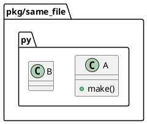

# Direct Dependency Relation Investigation

## 調査目的

PyClassUML で、クラスが内部で別クラスを直接使用している依存関係が PlantUML 出力に表示されないという報告を検証する。
特に、利用者が期待している黒い実線矢印 `-->` が出ない原因を、再現・コード inspection・既存仕様/テストの観点から切り分ける。

## 調査方法

- Deep consultant 2名に read-only の独立分析を依頼した。
- `src/pyclassuml/parse/indexer.py`、`src/pyclassuml/analyze/selection.py`、`src/pyclassuml/render/document.py`、関連テストを確認した。
- `build/manual-tests/direct-dependency-repro/` 配下に最小サンプルを作り、CLI を直接起動して PlantUML 出力を確認した。
- `uv run pyclassuml --help` は `/Volumes/990p2t/.cache/uv/sdists-v9/.git` の `Operation not permitted` で失敗したため、検証には次の直接起動を使った。

```bash
PYTHONPATH=src python -c 'from pyclassuml.cli.main import main; raise SystemExit(main())' ...
```

## 調査結果

### 問題の有無

問題は現行コードに存在する。
ただし、「黒い実線矢印を描画できない」のではなく、「通常メソッド内の直接使用から黒実線に分類される relation が生成されない」ことが本質である。

`src/pyclassuml/render/document.py` には `association -> -->` の写像がある。一方、通常の `B()` / `return B()` / ローカル変数利用 / 未注釈の属性保持は relation evidence として抽出されていない。

### 手動再現ケース

| case | 入力の要点 | 実行結果 | 観測 |
|---|---|---|---|
| `single_import` | `single_a.A.make()` が `from pkg.single_b import B` して `B()` を返す | `extracted_relation_count: 1` / `c001 ..> c002` | import edge fallback により relation は出るが黒実線ではない |
| `same_file` | 同一ファイル内で `A.make()` が `B()` を返す | `extracted_relation_count: 0` / relation line なし | method body 内 direct call は抽出されない |
| `typed_field` | `class A: b: B` | `extracted_relation_count: 1` / `c001 *-- c002` | 型注釈 field は composition になる |
| `typed_method` | `def consume(self, b: B) -> B` | `extracted_relation_count: 1` / `c001 ..> c002` | method parameter / return annotation は uses になる |
| `multi_import` | `from pkg.multi_target import B` だが target module に `B` と `Helper` がある | `warning_only_success` / `ambiguous_relation_endpoint` / relation line なし | 複数 class module では import edge fallback が落ちる |

代表コマンド:

```bash
PYTHONPATH=src python -c 'from pyclassuml.cli.main import main; raise SystemExit(main())' \
  generate build/manual-tests/direct-dependency-repro/pkg/same_file.py \
  --project-root build/manual-tests/direct-dependency-repro \
  --package-root build/manual-tests/direct-dependency-repro/pkg \
  --scope-root build/manual-tests/direct-dependency-repro/pkg \
  --depth 1 \
  --output build/manual-tests/direct-dependency-repro/same_file.puml
```

結果:

```text
outcome: clean_success
exit_code: 0
counters:
seed_file_count: 1
reachable_file_count: 1
extracted_class_count: 2
extracted_relation_count: 0
warning_count: 0
```

生成された PlantUML:



## 原因分析

### 主原因: parse seam が method body の直接使用を relation evidence にしない

- `src/pyclassuml/parse/indexer.py` の `_class_body_references()` は、通常 method body の `B()` / `B.method()` / `return B()` を relation evidence として抽出しない。
- 現在の抽出対象は、主に class base、field annotation、method parameter / return annotation、`__init__` の parameter-derived field annotation、class body の annotation / string / framework string hint に限られる。
- `relationship("Target")` のような call string arg は framework enrichment 用に拾えるが、plain call expression は対象外。

### 副原因: import edge fallback が module-to-module の 1 class 前提に依存している

- `src/pyclassuml/analyze/selection.py` の import edge fallback は、source module と target module の class count がどちらも 1 の場合だけ `SelectedRelation(... relation_type="uses", evidence_kind="module_import")` を作る。
- target module に複数 class があると `ambiguous_relation_endpoint` warning になり、target class selection も relation も追加されない。
- 実プロジェクトでは 1 module に複数 class があることが自然なので、この fallback は直接依存の実用的な代替になりにくい。

### render は主因ではない

- `src/pyclassuml/render/document.py` には `association: "-->"` の写像がある。
- したがって黒実線を描けないのではなく、黒実線に分類される relation が直接使用から作られていない。
- 現行の `uses` は `..>` に写像されるため、仮に import fallback で relation が出ても黒実線にはならない。

## Deep Consultant の要旨

### Consultant 1

- 現行コードに問題は実在しそう。
- 欠落段階は主に parse。次点で selection の multi-class module ambiguity。
- render が relation を消している線は弱い。
- 直接使用を `-->` として期待しているなら、現行仕様と実装は期待とズレている。

### Consultant 2

- `association -> -->` は描画可能だが、plain `B()`、ローカル変数、非 `__init__` の `self.b = b`、未注釈の属性保持は relation として抽出されない。
- 型注釈ベースの関係は現行仕様どおり `*--` または `..>` になる。
- `generate` と `diff` は同じ parse/analyze/render 経路を通るため、同じ欠落が出る。

## 推測 / 未検証事項

推測:

- 利用者が見た実プロジェクト上の欠落は、method body direct use 未抽出と multi-class module ambiguity の複合で起きている可能性が高い。
- `diff` でも同じ欠落が起きる可能性が高い。`generate` と `diff` は target normalization 後に同じ parse/analyze/render 経路を通るため。

未検証:

- `diff` コマンドでの直接再現はまだ代表ケースとして実行していない。
- `B.factory()`、`module.B()`、alias import、relative import、nested class、Protocol / framework enrichment との相互作用は未検証。
- `pytest` は current Python に未導入で、今回は自動テストでの確認は未実施。

## 判断への含意

- `requirement.md` では「direct use」の対象 AST パターンを明示する必要がある。
  - 候補: `B()`, `return B()`, `self.b = B()`, `local: B = B()`, `B.factory()`。
- `design.md` では、direct use evidence kind、target resolution、multi-class module の扱い、arrow type を分離して決める必要がある。
- 黒実線 `-->` を出すなら、direct use を `association` として分類するのか、別 relation type を追加するのか、既存 `uses` の描画を変えるのかを先に決める必要がある。
- import fallback 改善と method body direct use 抽出は別の欠陥クラスとして扱う方が安全。

## リスク/制約

- method body 解析を広げすぎると、単なる局所的な一時利用まで大量に relation 化して図が過密になる。
- target resolution を import alias / module qualified name / same-module short name まで広げる場合、ambiguity policy と warning policy を明確にしないと決定性が壊れる。
- 既存の typed relation と arrow mapping を変えると、既存テストや既存利用者の図の意味が変わる可能性がある。

## 反映先

- `../report.md`: この research を作成したことと、要件定義へ昇格すべき論点を記録する。
- future `requirement.md`: direct use 対象、黒実線期待、受入条件。
- future `design.md`: parse evidence、selection target resolution、relation classification、render mapping。
- future `plan.md`: characterization tests / regression tests / CLI manual evidence。

## 参考（References）

- `src/pyclassuml/parse/indexer.py`
  - `_class_body_references()`
  - `_call_string_arg_references()`
- `src/pyclassuml/analyze/selection.py`
  - `select_classes_and_relations()`
  - `_relation_type_for_reference()`
- `src/pyclassuml/render/document.py`
  - `_relation_arrow()`
- `tests/analyze/test_selection.py`
- `tests/render/test_document.py`
