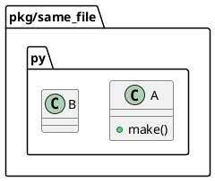
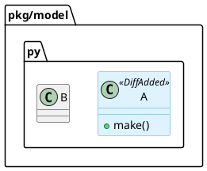

# Direct Dependency Relation Investigation

## 調査目的

PyClassUML で、クラスが内部で別クラスを直接使用している依存関係が PlantUML 出力に表示されないという報告を検証する。
特に、利用者が期待している黒い実線矢印 `-->` が出ない原因を、再現・コード inspection・既存仕様/テストの観点から切り分ける。

## 調査方法

- Deep consultant 2名に read-only の独立分析を依頼した。
- 追加の deep-consultant 1名に、要件定義前の scope / arrow semantics / ambiguity policy / interview question を絞って評価させた。
- `src/pyclassuml/parse/indexer.py`、`src/pyclassuml/analyze/selection.py`、`src/pyclassuml/render/document.py`、関連テストを確認した。
- `build/manual-tests/direct-dependency-repro/` 配下に最小サンプルを作り、CLI を直接起動して PlantUML 出力を確認した。
- `build/manual-tests/direct-dependency-diff-repro/` 配下に一時 Git repository を作り、`diff` コマンドで同一ファイル内 direct use の欠落を確認した。
- `uv run pyclassuml --help` は `/Volumes/990p2t/.cache/uv/sdists-v9/.git` の `Operation not permitted` で失敗したため、検証には次の直接起動を使った。

```bash
PYTHONPATH=src python -c 'from pyclassuml.cli.main import main; raise SystemExit(main())' ...
```

## 調査結果

### 問題の有無

問題は現行コードに存在する。
ただし、「黒い実線矢印を描画できない」のではなく、「通常メソッド内の直接使用から黒実線に分類される relation が生成されない」ことが本質である。

`src/pyclassuml/render/document.py` には `association -> -->` の写像がある。一方、通常の `B()` / `return B()` / ローカル変数利用 / 未注釈の属性保持は relation evidence として抽出されていない。

### 手動再現ケース

| case | 入力の要点 | 実行結果 | 観測 |
|---|---|---|---|
| `single_import` | `single_a.A.make()` が `from pkg.single_b import B` して `B()` を返す | `extracted_relation_count: 1` / `c001 ..> c002` | import edge fallback により relation は出るが黒実線ではない |
| `same_file` | 同一ファイル内で `A.make()` が `B()` を返す | `extracted_relation_count: 0` / relation line なし | method body 内 direct call は抽出されない |
| `typed_field` | `class A: b: B` | `extracted_relation_count: 1` / `c001 *-- c002` | 型注釈 field は composition になる |
| `typed_method` | `def consume(self, b: B) -> B` | `extracted_relation_count: 1` / `c001 ..> c002` | method parameter / return annotation は uses になる |
| `multi_import` | `from pkg.multi_target import B` だが target module に `B` と `Helper` がある | `warning_only_success` / `ambiguous_relation_endpoint` / relation line なし | 複数 class module では import edge fallback が落ちる |
| `alias_source` | `from pkg.alias_target import B as TargetB` して `TargetB()` を返す | `extracted_relation_count: 1` / `c001 ..> c002` | alias 解決ではなく one-class module import fallback による `uses` |
| `module_source` | `import pkg.module_target as mt` して `mt.B()` を返す | `extracted_relation_count: 1` / `c001 ..> c002` | module-qualified direct use ではなく one-class module import fallback |
| `class_attr_call` | 同一ファイル内で `B.factory()` を返す | `extracted_relation_count: 0` | class attribute / static call は抽出されない |
| `init_call` | `__init__` 内で `self.b = B()` | `extracted_relation_count: 0` | 未注釈の instance attribute assignment は抽出されない |
| `local_annotated_call` | method body で `item: B = B()` | `extracted_relation_count: 0` | method body local annotation は抽出されない |
| `static_call` | 別 module import 後に `B.factory()` | `extracted_relation_count: 1` / `c001 ..> c002` | class access ではなく one-class module import fallback |

代表コマンド:

```bash
PYTHONPATH=src python -c 'from pyclassuml.cli.main import main; raise SystemExit(main())' \
  generate build/manual-tests/direct-dependency-repro/pkg/same_file.py \
  --project-root build/manual-tests/direct-dependency-repro \
  --package-root build/manual-tests/direct-dependency-repro/pkg \
  --scope-root build/manual-tests/direct-dependency-repro/pkg \
  --depth 1 \
  --output build/manual-tests/direct-dependency-repro/same_file.puml
```

結果:

```text
outcome: clean_success
exit_code: 0
counters:
seed_file_count: 1
reachable_file_count: 1
extracted_class_count: 2
extracted_relation_count: 0
warning_count: 0
```

生成された PlantUML:



### diff 代表ケース

`diff` コマンドでも同じ欠落を確認した。

一時 Git repository の baseline は `pkg/model.py` に `B` だけを持つ状態とし、working tree で同一ファイルに `A.make()` を追加して `return B()` する状態にした。

実行コマンド:

```bash
PYTHONPATH=src python -c 'from pyclassuml.cli.main import main; raise SystemExit(main())' \
  diff \
  --cwd /Users/iwasawayuuta/workspace/tools/pyclassuml/build/manual-tests/direct-dependency-diff-repro \
  --project-root /Users/iwasawayuuta/workspace/tools/pyclassuml/build/manual-tests/direct-dependency-diff-repro \
  --package-root /Users/iwasawayuuta/workspace/tools/pyclassuml/build/manual-tests/direct-dependency-diff-repro/pkg \
  --scope-root /Users/iwasawayuuta/workspace/tools/pyclassuml/build/manual-tests/direct-dependency-diff-repro/pkg \
  --base HEAD \
  --output /Users/iwasawayuuta/workspace/tools/pyclassuml/build/manual-tests/direct-dependency-diff-repro/diff_same_file.puml
```

結果:

```text
outcome: clean_success
exit_code: 0
base_resolution: explicit_base
resolved_base: HEAD
requested_base: HEAD
counters:
seed_file_count: 1
reachable_file_count: 1
extracted_class_count: 2
extracted_relation_count: 0
changed_class_count: 2
warning_count: 0
```

生成された PlantUML:



この結果から、`generate` 固有ではなく、共通の parse/analyze 経路で relation evidence が作られていないことが確認できた。

## 原因分析

### 主原因: parse seam が method body の直接使用を relation evidence にしない

- `src/pyclassuml/parse/indexer.py` の `_class_body_references()` は、通常 method body の `B()` / `B.method()` / `return B()` を relation evidence として抽出しない。
- 現在の抽出対象は、主に class base、field annotation、method parameter / return annotation、`__init__` の parameter-derived field annotation、class body の annotation / string / framework string hint に限られる。
- `relationship("Target")` のような call string arg は framework enrichment 用に拾えるが、plain call expression は対象外。
- `FunctionDef` / `AsyncFunctionDef` の通常 statement body を汎用 walk していないため、同一ファイル内の明示的 `B()` でも relation が生成されない。

### 副原因: import edge fallback が module-to-module の 1 class 前提に依存している

- `src/pyclassuml/analyze/selection.py` の import edge fallback は、source module と target module の class count がどちらも 1 の場合だけ `SelectedRelation(... relation_type="uses", evidence_kind="module_import")` を作る。
- target module に複数 class があると `ambiguous_relation_endpoint` warning になり、target class selection も relation も追加されない。
- 実プロジェクトでは 1 module に複数 class があることが自然なので、この fallback は直接依存の実用的な代替になりにくい。

### render は主因ではない

- `src/pyclassuml/render/document.py` には `association: "-->"` の写像がある。
- したがって黒実線を描けないのではなく、黒実線に分類される relation が直接使用から作られていない。
- 現行の `uses` は `..>` に写像されるため、仮に import fallback で relation が出ても黒実線にはならない。

## Deep Consultant の要旨

### Consultant 1

- 現行コードに問題は実在しそう。
- 欠落段階は主に parse。次点で selection の multi-class module ambiguity。
- render が relation を消している線は弱い。
- 直接使用を `-->` として期待しているなら、現行仕様と実装は期待とズレている。

### Consultant 2

- `association -> -->` は描画可能だが、plain `B()`、ローカル変数、非 `__init__` の `self.b = b`、未注釈の属性保持は relation として抽出されない。
- 型注釈ベースの関係は現行仕様どおり `*--` または `..>` になる。
- `generate` と `diff` は同じ parse/analyze/render 経路を通るため、同じ欠落が出る。

### Consultant 3

- iss-00040 は「クラス本体内の実行文に現れる直接的な内部クラス参照を抽出し、UML 上で直接依存として可視化する最小バグ修正」と定義するのが妥当。
- import fallback の精度改善、Python の完全な名前解決、動的 import、文字列 eval、factory 戻り値推論、変数代入追跡は別 issue に分離すべき。
- 黒実線 `-->` を必須 product contract とするなら、現行 render の `association` に寄せるのが最小。ただし UML 的には method body の一時利用は `uses` / dependency `..>` に近いため、これは要件上の明示判断が必要。
- ambiguity は推測で relation を出さず、一意に解決できる場合だけ relation を作る方が決定性を保てる。

### Consultant 4

- iss-00040 の受入条件は狭く固定すべきであり、既存の typed relation semantics を変えない guard を置くべき。
- `generate` では、解決可能な未型付け direct class use から `A --> B` を出すことを中核 AC にするのが妥当。
- `diff` は同じ解析経路の代表 smoke として確認すべき。
- two-file import、multi-class target の explicit imported symbol、import alias、relative import は AC 候補として重要。ただし module-qualified import、`self.b = B()`、local variable、`B.factory()`、wildcard / re-export / dynamic resolution は scope creep になりやすい。
- この consultant は diff 再現を未検証と扱っていたが、親調査でその後 `diff` 同一ファイル direct use の relation 0 を確認済みである。

### Consultant 5

- renderer バグではなく、class body 内の実行文に現れる内部 class reference を relation evidence にしていない parse/analyze 側のバグとして要件化するのが正確。
- `generate` / `diff` は共通経路で同じ欠落を起こすため、両方を受入条件に含めるべき。
- 既存 `uses -> ..>` と typed method parameter / return の semantics は変えない方がよい。
- direct runtime use だけを黒実線 `-->` にするのが user expectation と互換性の両方を満たしやすい。
- 内部実装では既存 `association` を流用する案と、新 `dependency` relation_type を追加して `-->` に写像する案があり、長期的には後者の方が意味が明快。
- direct use scope としては、`B()`, `return B()`, `x = B()`, `self.b = B()`, class body `b = B()`, `B.factory()` / class object reference, module-qualified access, alias import を MVP 候補にできる。ただし `isinstance`, `raise`, `except`, dynamic lookup, data-flow inference, nested function / lambda body は defer が妥当。
- Relation priority 上は、direct use は composition / aggregation / inherits を上書きせず、import fallback や method annotation `uses` より優先するのが自然。

## 推測 / 未検証事項

推測:

- 利用者が見た実プロジェクト上の欠落は、method body direct use 未抽出と multi-class module ambiguity の複合で起きている可能性が高い。
- `diff` でも同じ欠落が起きる可能性が高い。`generate` と `diff` は target normalization 後に同じ parse/analyze/render 経路を通るため。

未検証:

- nested class、Protocol / framework enrichment との相互作用は未検証。
- `pytest` は current Python に未導入で、今回は自動テストでの確認は未実施。
- import alias / module-qualified class access は現行出力上 relation が出るケースがあるが、今回の手動確認では one-class module import fallback と区別できる direct-use 解決としては確認できていない。

## 判断への含意

- `requirement.md` では「direct use」の対象 AST パターンを明示する必要がある。
  - 候補: `B()`, `return B()`, `self.b = B()`, `local: B = B()`, `B.factory()`。
- `design.md` では、direct use evidence kind、target resolution、multi-class module の扱い、arrow type を分離して決める必要がある。
- 黒実線 `-->` を出すなら、direct use を `association` として分類するのか、別 relation type を追加するのか、既存 `uses` の描画を変えるのかを先に決める必要がある。
- import fallback 改善と method body direct use 抽出は別の欠陥クラスとして扱う方が安全。
- `generate` と `diff` は同じ欠落を示したため、要件は両コマンド共通の挙動として定義する方が自然である。
- 最小修正では「一意に解決できる内部 class reference だけ relation 化し、曖昧な候補は warning / skip」とするのが決定性を保ちやすい。
- ただし consultant 間で「explicit import された multi-class target module の `B` を AC に含めるか」は見解が分かれた。
  - 強い AC にする案: `from pkg.target import B` という明示的 imported symbol があるなら、target module に `Helper` があっても `B` に解決すべき。
  - 保守的な案: multi-class module fallback の改善は import resolution の別課題として defer し、同一ファイル / 一意解決可能な参照から直す。
  - これは target resolution の実装量と今回の bugfix scope を左右するため、要件定義前の確認対象とする。

## 要件定義前に必要なユーザー確認

次の論点はコード調査だけでは決められない product semantics であるため、`discussions/20260522t090118z-interview-direct-dependency-requirement-interview.md` にヒアリング項目として切り出した。

1. Method body の `B()` / `B.factory()` などを、UML 的な dependency `..>` ではなく、報告どおり黒実線 `-->` として扱うか。
2. 今回の必須 direct-use pattern をどこまで含めるか。
3. `self.b = B()` のような instance attribute assignment を direct dependency として扱うか、構造的 relation として扱うか、今回は defer するか。
4. import alias / module-qualified access / multi-class module ambiguity を今回どこまで扱うか。
5. 型注釈由来 relation と実行文 direct-use relation の矢印を統一するか、別 semantics として残すか。
6. `from pkg.target import B` のような explicit import は、target module が multi-class でも今回の AC に含めるか。
7. 内部 relation_type として既存 `association` を流用するか、`dependency` などの新 relation type を追加して `-->` に写像するか。

## リスク/制約

- method body 解析を広げすぎると、単なる局所的な一時利用まで大量に relation 化して図が過密になる。
- target resolution を import alias / module qualified name / same-module short name まで広げる場合、ambiguity policy と warning policy を明確にしないと決定性が壊れる。
- 既存の typed relation と arrow mapping を変えると、既存テストや既存利用者の図の意味が変わる可能性がある。

## 反映先

- `../report.md`: この research を作成したことと、要件定義へ昇格すべき論点を記録する。
- future `requirement.md`: direct use 対象、黒実線期待、受入条件。
- future `design.md`: parse evidence、selection target resolution、relation classification、render mapping。
- future `plan.md`: characterization tests / regression tests / CLI manual evidence。

## 参考（References）

- `src/pyclassuml/parse/indexer.py`
  - `_class_body_references()`
  - `_call_string_arg_references()`
- `src/pyclassuml/analyze/selection.py`
  - `select_classes_and_relations()`
  - `_relation_type_for_reference()`
- `src/pyclassuml/render/document.py`
  - `_relation_arrow()`
- `tests/analyze/test_selection.py`
- `tests/render/test_document.py`
