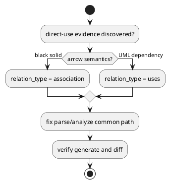

# 20260522t090118z-interview Direct Dependency Requirement Interview

## 位置づけ

この interview は、iss-00040 の `requirement.md` を作成する前に、コード調査だけでは決められない product semantics を確認するための記録である。

調査で確定した技術事実は `20260522t084855z-research-direct-dependency-relation-investigation.md` にまとめた。
本書では、要件化に必要な人間判断だけを扱う。

## ヒアリング概要 (必須)
- 対象者:
  - pyclassuml owner / user
- 回答が必要な理由:
  - 「直接内部で他のクラスを使用する直接的な依存」を、PyClassUML の relation semantics と PlantUML 矢印にどう写像するかは、コード調査だけでは決められない。
  - 特に、利用者表現の「黒い実線の依存」が UML 的な association `-->` を意味するのか、より一般的な dependency 表示を意味するのかで、実装対象と受入条件が変わる。
- 反映予定先:
  - `requirement.md`:
    - direct-use の対象パターン、必須矢印、generate / diff の受入条件。
  - `design.md`:
    - evidence kind、relation type、target resolution、ambiguity policy。
  - `plan.md`:
    - characterization / regression test matrix。
  - `adr`:
    - 既存 UML semantics を変える判断が長期契約になる場合のみ検討する。

## 質問ブロック（必要な数だけ繰り返す） (必須)

### 質問 1
- 質問主題:
  - Method body direct use の矢印 semantics。
- 回答してほしいこと:
  - `A.make()` の中で `return B()` / `B()` / `B.factory()` のように `B` を直接参照する場合、PlantUML では必ず黒実線 `A --> B` として表示したいか。
- なぜ質問するのか:
  - 現行 render では `association` が `-->`、`uses` が `..>` に写像される。UML 的には method body の一時利用は `uses` / dependency `..>` に近いが、ユーザー報告は黒実線を期待している。
- 背景:
  - 現行コードは typed field を `*--`、method parameter / return annotation を `..>` にする。plain `B()` はそもそも relation 化しない。
- 詳細説明:
  - 要件で黒実線を固定すると、direct-use evidence を `association` として扱う設計が最小になる。`uses` にすると UML 的には自然だが、報告された期待とはズレる可能性がある。
- 事前分析:
  - 確認済みの docs / code / tests / ADR / discussions / primary source:
    - `src/pyclassuml/render/document.py`: `association -> -->`, `uses -> ..>`
    - `src/pyclassuml/analyze/selection.py`: method annotation は `uses`
    - `discussions/20260522t084855z-research-direct-dependency-relation-investigation.md`
  - まだ人間判断が必要な理由:
    - UML 的厳密さと、pyclassuml の product UX としての可視性のどちらを優先するかは設計思想の判断である。
- 回答案:
  - A:
    - direct-use は黒実線 `-->` として表示する。
  - B:
    - direct-use は UML dependency として `..>` で表示する。
- 選択肢比較:
  - 評価軸:
    - 利用者期待との一致、UML 的意味の自然さ、既存 relation semantics への影響、テストしやすさ。
- メリット:
  - A:
    - ユーザー報告の「黒い実線の依存」をそのまま満たせる。render 既存写像を変更せずに済む。
  - B:
    - UML semantics としては method body の一時利用に近い。既存 `uses` の意味と整合しやすい。
- デメリット:
  - A:
    - 一時利用を association として描くため、構造的な保持関係と混同される可能性がある。
  - B:
    - 「黒い実線が出ない」という元の期待を満たさない可能性がある。
- リスク:
  - A を選ぶ場合は、association の意味を pyclassuml 独自の direct internal dependency として明記しないと、長期的に UML 意味論の混乱が残る。
- ベストプラクティス分析:
  - UML 厳密性だけなら dependency `..>` が自然。ただしこの tool の目的が「内部依存を見逃さず可視化すること」であれば、黒実線を product contract として採用する余地がある。
- 推奨案:
  - A。iss-00040 では user-reported bug を解決するため、direct internal class dependency を黒実線 `-->` として要件化する。ただし design に UML strict semantics との違いを記録する。
- 未回答時の影響:
  - `requirement.md` の受入条件と `design.md` の relation type が確定しない。
- 回答欄:
  - 未回答
- 回答後フォローアップ:
  - 反映先:
    - `requirement.md`, `design.md`, 必要なら ADR
  - 追加で作る discussion docs:
    - 長期 semantics 判断になる場合は `adr`

### 質問 2
- 質問主題:
  - 今回必須にする direct-use AST pattern。
- 回答してほしいこと:
  - 次のうち、iss-00040 の必須受入条件に含めたいものを確認したい。
  - `B()`
  - `return B()`
  - `B.factory()` / `B.static_method()`
  - `module.B()`
  - `isinstance(x, B)` / `issubclass(x, B)`
  - `typing.cast(B, x)`
  - method body local annotation `item: B = ...`
- なぜ質問するのか:
  - 範囲を広げすぎると、図が過密になり、名前解決や false positive の設計負荷が増える。
- 事前分析:
  - 確認済み:
    - 現行は `B()` / `B.factory()` / local annotation を relation 化しない。
    - one-class module import があると `..>` が出ることがあるが、direct-use 解決ではなく import fallback である。
  - まだ人間判断が必要な理由:
    - どこまでを「直接依存」としてユーザー価値のある必須表示にするかは product scope の判断である。
- 回答案:
  - A:
    - MVP は `B()` / `return B()` / `B.factory()` / `module.B()` まで。
  - B:
    - MVP は上記に加えて `isinstance` / `issubclass` / `cast` / local annotation も含める。
  - C:
    - MVP は `B()` / `return B()` のみ。残りは follow-up。
- 推奨案:
  - A。ユーザーが「直接内部で他のクラスを使用」と表現した中核に近く、過度な型推論に踏み込まない。
- 回答欄:
  - 未回答

### 質問 3
- 質問主題:
  - `self.b = B()` の扱い。
- 回答してほしいこと:
  - `__init__` や method body の `self.b = B()` を、今回の direct dependency 表示対象に含めるか。
- なぜ質問するのか:
  - `self.b = B()` は「使用」でもあり「保持」でもあるため、association / composition / aggregation のどれに寄せるかが曖昧になる。
- 事前分析:
  - 現行は `self.b: B` や typed field は relation 化されるが、`self.b = B()` は relation 化されない。
- 回答案:
  - A:
    - `self.b = B()` も direct dependency として黒実線 `-->`。
  - B:
    - `self.b = B()` は構造的保持の可能性があるため、この issue では defer。
  - C:
    - `self.b = B()` は composition / aggregation として扱う。
- 推奨案:
  - A寄り。ownership を推測して `*--` にするのではなく、runtime direct use として黒実線 `-->` に留めれば、過度な保持 semantics を避けつつ欠落を修正できる。ただし図の過密化を避けたい場合は B。
- 回答欄:
  - 未回答

### 質問 4
- 質問主題:
  - ambiguity policy。
- 回答してほしいこと:
  - 名前解決候補が複数ある場合、推測で矢印を出さず、warning として relation を出さない方針でよいか。
- なぜ質問するのか:
  - multi-class module / alias / re-export / star import では、誤った矢印を出すリスクがある。
- 事前分析:
  - 現行も multi-class module import fallback では `ambiguous_relation_endpoint` warning にして relation を出さない。
- 回答案:
  - A:
    - 一意に解決できる場合だけ relation を出し、曖昧なら warning / skip。
  - B:
    - 誤判定リスクを取っても、候補の中から推測して表示する。
- 推奨案:
  - A。pyclassuml の決定性と静的解析の信頼性を優先する。
- 回答欄:
  - 未回答

### 質問 5
- 質問主題:
  - explicit import された multi-class target module の扱い。
- 回答してほしいこと:
  - `from pkg.target import B` と明示的に `B` を import している場合、`target.py` に `B` と `Helper` など複数 class があっても、今回の issue で `A --> B` を必須にするか。
- なぜ質問するのか:
  - 現行の module import fallback は target module に複数 class があると `ambiguous_relation_endpoint` で relation を出さない。一方、明示 import された symbol を解決するなら、実プロジェクトでの有用性は大きい。
- 事前分析:
  - 確認済み:
    - 現行 `multi_import` 手動再現では `from pkg.multi_target import B` でも `B` が選択されず relation も出ない。
    - consultant 間で、これを今回の AC に含める案と、import resolution 改善として defer する案が分かれた。
  - まだ人間判断が必要な理由:
    - これを必須にすると alias/import symbol table の設計が必要になり、単なる method body walk より実装範囲が広がる。
- 回答案:
  - A:
    - 今回の AC に含める。明示 import された `B` は multi-class target module でも `B` に解決する。
  - B:
    - 今回は defer。同一ファイルや一意解決可能な direct use を先に直す。
- 推奨案:
  - A寄り。ただし工数を最小化したい場合は B。ユーザー報告が実プロジェクト由来なら、multi-class module は頻出するため A の価値が高い。
- 回答欄:
  - 未回答

### 質問 6
- 質問主題:
  - `generate` と `diff` の共通受入条件。
- 回答してほしいこと:
  - この修正は `generate` と `diff` の両方で同じ direct dependency 表示を満たす、という要件でよいか。
- なぜ質問するのか:
  - 手動再現では両コマンドで同じ欠落が確認された。共通経路で直すのが自然だが、受入条件にも明記したい。
- 回答案:
  - A:
    - `generate` / `diff` 両方を必須受入条件にする。
  - B:
    - まず `generate` のみを必須にし、`diff` は follow-up。
- 推奨案:
  - A。共通 parse/analyze 経路の欠落であり、片方だけ直す意味は薄い。
- 回答欄:
  - 未回答

### 質問 7
- 質問主題:
  - 内部 relation type の設計。
- 回答してほしいこと:
  - 黒実線 `-->` を出すために、既存 `association` を流用するか、新しい `dependency` relation type を追加して `-->` に写像するか。
- なぜ質問するのか:
  - 既存 render では `association -> -->`、`uses -> ..>` である。`association` を流用すると変更は小さいが、構造的 association と runtime direct dependency の意味が混ざる。`dependency` を新設すると意味は明快だが、relation priority / tests / rendering contract を増やす必要がある。
- 事前分析:
  - 確認済み:
    - `uses -> ..>` は typed method parameter / return の既存仕様としてテストされているため、変更すべきではない。
    - direct runtime use は `uses` より黒実線表示の期待が強く、現行 mapping では `association` か新 relation type が候補になる。
- 回答案:
  - A:
    - 既存 `association` を流用し、direct-use relation を `-->` にする。
  - B:
    - 新 `dependency` relation type を追加し、`dependency -> -->` にする。
- 推奨案:
  - B。長期的には typed/uses と structural association と runtime direct dependency の意味が分かれる。ただし issue を最小化するなら A も許容可能。
- 回答欄:
  - 未回答

## 図解（任意）

