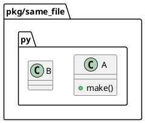

# iss-00040 Render Direct Class Dependency — 調査レポート

この report は、Issue 開始直後の初期調査 evidence と判断を記録する。
ユーザー指示により、この時点では `requirement.md` / `design.md` / `plan.md` の本格作成は行わず、今回確認した不具合の再現・原因・次アクションを report に集約する。

## 調査サマリー

- 問題は現行コードに存在する。
- `association -> -->` の描画機能自体は存在するが、通常メソッド内の `B()` / `return B()` / ローカル変数利用 / 未注釈の属性保持は relation evidence として抽出されない。
- `generate` と `diff` は `parse -> traversal -> selection -> frameworks -> render` の共通経路を通るため、`generate` で欠落する直接使用 relation は `diff` でも同様に欠落する。
- import edge 由来の fallback relation は、source module / target module がそれぞれ 1 class の場合だけ `uses` として生成される。target module に複数 class があるだけで `ambiguous_relation_endpoint` になり、relation も dependency class selection も落ちる。
- `uses` は現行 renderer では `..>` に対応している。黒実線 `-->` は `association` に対応するため、「直接使用を黒実線で表したい」という期待に対しては、抽出・分類仕様が不足している。

## 再現確認

### 実行環境

- repo: `/Users/iwasawayuuta/workspace/tools/pyclassuml`
- branch after issue start: `iss-00040-render-direct-class-dependency`
- `uv run pyclassuml --help` は `/Volumes/990p2t/.cache/uv/sdists-v9/.git` の `Operation not permitted` で失敗したため、CLI は `PYTHONPATH=src python -c 'from pyclassuml.cli.main import main; raise SystemExit(main())' ...` で直接起動した。
- `pytest` は current Python に未導入だったため、今回の確認は CLI 手動再現とコード inspection で行った。

### 手動再現ケース

再現用の一時サンプルは `build/manual-tests/direct-dependency-repro/` 配下に作成した。`build/` 配下のため git tracked 変更には含まれていない。

| case | 入力の要点 | 実行結果 | 観測 |
|---|---|---|---|
| `single_import` | `single_a.A.make()` が `from pkg.single_b import B` して `B()` を返す | `extracted_relation_count: 1` / `c001 ..> c002` | import edge fallback により relation は出るが黒実線ではない |
| `same_file` | 同一ファイル内で `A.make()` が `B()` を返す | `extracted_relation_count: 0` / relation line なし | method body 内 direct call は抽出されない |
| `typed_field` | `class A: b: B` | `extracted_relation_count: 1` / `c001 *-- c002` | 型注釈 field は composition になる |
| `typed_method` | `def consume(self, b: B) -> B` | `extracted_relation_count: 1` / `c001 ..> c002` | method parameter / return annotation は uses になる |
| `multi_import` | `from pkg.multi_target import B` だが target module に `B` と `Helper` がある | `warning_only_success` / `ambiguous_relation_endpoint` / relation line なし | 複数 class module では import edge fallback が落ちる |

### 代表コマンド

```bash
PYTHONPATH=src python -c 'from pyclassuml.cli.main import main; raise SystemExit(main())' \
  generate build/manual-tests/direct-dependency-repro/pkg/same_file.py \
  --project-root build/manual-tests/direct-dependency-repro \
  --package-root build/manual-tests/direct-dependency-repro/pkg \
  --scope-root build/manual-tests/direct-dependency-repro/pkg \
  --depth 1 \
  --output build/manual-tests/direct-dependency-repro/same_file.puml
```

結果:

```text
outcome: clean_success
exit_code: 0
counters:
seed_file_count: 1
reachable_file_count: 1
extracted_class_count: 2
extracted_relation_count: 0
warning_count: 0
```

生成された PlantUML:



## 原因分析

### 主原因: parse seam が method body の直接使用を relation evidence にしない

- `src/pyclassuml/parse/indexer.py` の `_class_body_references()` は、通常 method body の `B()` / `B.method()` / `return B()` を relation evidence として抽出しない。
- 現在の抽出対象は、主に class base、field annotation、method parameter / return annotation、`__init__` の parameter-derived field annotation、class body の annotation / string / framework string hint に限られる。
- `relationship("Target")` のような call string arg は framework enrichment 用に拾えるが、plain call expression は対象外。

### 副原因: import edge fallback が module-to-module の 1 class 前提に依存している

- `src/pyclassuml/analyze/selection.py` の import edge fallback は、source module と target module の class count がどちらも 1 の場合だけ `SelectedRelation(... relation_type="uses", evidence_kind="module_import")` を作る。
- target module に複数 class があると `ambiguous_relation_endpoint` warning になり、target class selection も relation も追加されない。
- 実プロジェクトでは 1 module に複数 class があることが自然なので、この fallback は直接依存の実用的な代替になりにくい。

### render は主因ではない

- `src/pyclassuml/render/document.py` には `association: "-->"` の写像がある。
- したがって黒実線を描けないのではなく、黒実線に分類される relation が直接使用から作られていない。
- 現行の `uses` は `..>` に写像されるため、仮に import fallback で relation が出ても黒実線にはならない。

## 参照した主なコード箇所

- `src/pyclassuml/parse/indexer.py`
  - `_class_body_references()`: method body direct use を抽出していない。
  - `_call_string_arg_references()`: string first-arg call 専用で、plain `B()` は扱わない。
- `src/pyclassuml/analyze/selection.py`
  - `select_classes_and_relations()`: import edge fallback が source / target 1 class 前提。
  - `_relation_type_for_reference()`: relation type 変換対象に method body direct use の evidence kind がない。
- `src/pyclassuml/render/document.py`
  - `_relation_arrow()`: `association -> -->`, `uses -> ..>`。
- `tests/analyze/test_selection.py`
  - multi-class module で ambiguity warning にする既存期待がある。
- `tests/render/test_document.py`
  - relation type と PlantUML arrow mapping の既存期待がある。

## Deep Consultant 分析結果

### Consultant 1

- 現行コードに問題は実在しそう。
- 欠落段階は主に parse。次点で selection の multi-class module ambiguity。
- render が relation を消している線は弱い。
- 直接使用を `-->` として期待しているなら、現行仕様と実装は期待とズレている。

### Consultant 2

- `association -> -->` は描画可能だが、plain `B()`、ローカル変数、非 `__init__` の `self.b = b`、未注釈の属性保持は relation として抽出されない。
- 型注釈ベースの関係は現行仕様どおり `*--` または `..>` になる。
- `generate` と `diff` は同じ parse/analyze/render 経路を通るため、同じ欠落が出る。

## Spec Interpretation / Decision Ledger

| ID | Status | Type | Raised By | Trigger / Gap | Options Considered | Decision / Interpretation | Rationale | Disposition | Evidence | Follow-up |
|---|---|---|---|---|---|---|---|---|---|---|
| D-001 | open | scope | user / investigation | `B()` のような method body direct use が黒実線で表示されない | direct use を association とする; uses として点線にする; import fallback のみ改善する | 要件定義で「direct use」の対象 AST と arrow type を明示する必要がある | 現行コードは `association -> -->` を持つが direct use evidence を作らないため、仕様固定なしに実装すると `uses` / `association` の意味がぶれる | deferred | 手動再現 `same_file` relation count 0、`single_import` は `..>` | `requirement.md` で AC / EC に昇格 |
| D-002 | open | test-strategy | investigation | import fallback が multi-class module で落ちる | direct use resolver で imported symbol を class id に解決する; module ambiguity policy を維持する; warning を変える | 実装修正では、direct use evidence の target resolution と multi-class module の扱いを別問題として切り分ける必要がある | `from pkg.multi_target import B` でも target module に `Helper` があるだけで relation が落ちるため、ユーザー観測の主要原因になりうる | deferred | 手動再現 `multi_import` で `ambiguous_relation_endpoint` | `design.md` で resolution strategy に昇格 |

## 実装記録（セッションログ）

### 2026-05-22 17:41 - 18:00 JST

#### 対象

- Step: issue creation / initial investigation report
- AC/EC: 未作成
- Planned source:
  - ユーザー指示: bugfix initiative / lightweight bugfix epic / single issue を作成し、issue start 後に調査レポートを作成する。

#### 実施内容

- `init-00038 Bugfix Direct Dependency Relations` を作成した。
- `epic-00039 Small Direct Dependency Fix` を作成した。
- `iss-00040 Render Direct Class Dependency` を作成した。
- `issue start iss-00040` は最初に新規 scaffold 未コミットのため checkout safety で失敗した。
- scaffold 作成分を `a3b45aa` にコミットし、再度 `issue start iss-00040` を実行して成功した。
- issue start 後、要件定義書は作成せず、本 report に調査結果を記録した。

#### 実行コマンド / 結果

```bash
./spec-dock/scripts/spec-dock new initiative --create-github-issue --title "Bugfix Direct Dependency Relations" --slug bugfix-direct-dependency-relations
# ok: id=init-00038 github=#38

./spec-dock/scripts/spec-dock new epic --create-github-issue --initiative init-00038 --title "Small Direct Dependency Fix" --slug small-direct-dependency-fix
# ok: id=epic-00039 github=#39

./spec-dock/scripts/spec-dock new issue --create-github-issue --epic epic-00039 --title "Render Direct Class Dependency" --slug render-direct-class-dependency
# ok: id=iss-00040 github=#40

./spec-dock/scripts/spec-dock issue start iss-00040
# first attempt failed: Working tree is not clean

git commit -m "docs(spec-dock): 直接依存表示修正の作業ツリーを追加" ...
# ok: a3b45aa

./spec-dock/scripts/spec-dock issue start iss-00040
# ok: branch=iss-00040-render-direct-class-dependency

./spec-dock/scripts/spec-dock validate
# ok: nodes=39

./spec-dock/scripts/spec-dock sync
# ok: active unchanged (matched id in branch: iss-00040)
```

#### Red/Green/Refactor Evidence

| step | phase | planned evidence requirement | observed evidence | command / inspection / manual record | result | notes |
|---|---|---|---|---|---|---|
| investigation | characterization | manual-required | direct use 欠落を CLI 手動再現で確認 | `PYTHONPATH=src python -c 'from pyclassuml.cli.main import main; raise SystemExit(main())' generate ...` | pass | `uv run` は環境権限で不可 |
| investigation | inspection | inspect-only | parse / selection / render の責務境界を確認 | `src/pyclassuml/parse/indexer.py`, `src/pyclassuml/analyze/selection.py`, `src/pyclassuml/render/document.py` | pass | render は主因ではない |

#### Discovered Tests

| step | discovered test / risk | source | action taken | closure id / new id | plan amendment required | evidence |
|---|---|---|---|---|---|---|
| investigation | 同一ファイル内 `return B()` で relation 0 | manual repro | requirement/design へ昇格予定 | TBD | yes | `same_file.puml` |
| investigation | `from module import B` でも target module 複数 class で relation 0 | manual repro | design の target resolution strategy へ昇格予定 | TBD | yes | `multi_import` stdout |
| investigation | `uses` は `..>` であり黒実線ではない | code inspection | arrow policy を requirement/design で固定予定 | TBD | yes | `_relation_arrow()` |

#### Workflow Delegation Consent

| consent source | repo/worktree | active issue | session | named roles | boundary | expires / invalidation condition | denied / unavailable reason | next action |
|---|---|---|---|---|---|---|---|---|
| user instruction: deep consultant analysis requested in prior turn | `/Users/iwasawayuuta/workspace/tools/pyclassuml` | iss-00040 | current session | deep-consultant | read-only investigation only; no destructive action / publishing / credentialed access / scope expansion / write-capable delegation | session end / scope change / user revocation | none | use findings as investigation evidence |

#### Implementation Delegation Gate

| step | decision | required reason | delegated role | delegated scope | source of truth | allowed changes | forbidden changes | required verification | stop conditions | output required | observed result |
|---|---|---|---|---|---|---|---|---|---|---|---|
| investigation | delegated | user explicitly requested deep-consultant analysis | deep-consultant x2 | read-only root cause analysis and repro strategy | current repo code, tests, docs | none | file edits, commits, external publication | code inspection and reproducibility assessment | unable to inspect repo / conflicting evidence | Japanese root cause report | pass |
| report update | approved-local-execution | report-only orchestration metadata; user explicitly requested report creation | N/A | active issue report | this session investigation evidence | `report.md` only | runtime code, requirement/design/plan substantive authoring | `spec-dock validate` after report update | validation failure | report content and validation evidence | pass |

#### Delegated Worker Evidence

| step | delegated role | delegated worker summary | changed files | tests run or docs-only verification | reviewer verdict | unresolved risks | parent integration decision |
|---|---|---|---|---|---|---|---|
| investigation | deep-consultant | method body direct use is not parsed; selection ambiguity drops multi-class import fallback; render is not primary cause | none | read-only inspection | N/A | exact AST scope and arrow semantics require requirement/design | accepted |
| investigation | deep-consultant | plain `B()` / local var / untyped holding are not relationized; typed relations behave as existing spec | none | read-only inspection | N/A | direct use may need target resolution design separate from arrow policy | accepted |

#### Parent Implementation Exception

| step | delegation unavailable/impossible reason | user approval / risk acceptance | allowed files | allowed operation | rollback plan | post-change verification | reviewer gate | unavailable / denied / host conflict / waiver handling |
|---|---|---|---|---|---|---|---|---|
| report update | report-only orchestration metadata is allowed for parent Codex under workflow policy | user requested report creation | `spec-dock/active/issue/report.md` | replace template with investigation report | revert this report diff | `./spec-dock/scripts/spec-dock validate` | not requested for initial report-only handoff | N/A |

#### Reviewer Gate Status

| step | gate name | reviewer role | freshness | state | risk acceptance | promotion / completion decision | notes |
|---|---|---|---|---|---|---|---|
| investigation report | initial report review | N/A | N/A | provisional | no | continue to requirement authoring next | no implementation or final gate attempted |

#### Step Commit Gate

| step | closure state | commit scope | commit hash / final ledger | post-commit clean check | no-op rationale | no-op checked contracts / files | no-op diff-clean command | no-op read-only confirmation |
|---|---|---|---|---|---|---|---|---|
| scaffold creation | committed | new initiative / epic / issue scaffold | `a3b45aa` | `git status --short --branch` before issue start showed branch ahead 1 and no unstaged changes | N/A | N/A | N/A | N/A |
| investigation report | pending commit | report update only | pending | pending | N/A | N/A | N/A | N/A |

#### 変更したファイル

- `spec-dock/initiatives/init-00038-bugfix-direct-dependency-relations/` - new bugfix initiative scaffold.
- `spec-dock/initiatives/init-00038-bugfix-direct-dependency-relations/epics/epic-00039-small-direct-dependency-fix/` - new lightweight bugfix epic scaffold.
- `spec-dock/initiatives/init-00038-bugfix-direct-dependency-relations/epics/epic-00039-small-direct-dependency-fix/issues/iss-00040-render-direct-class-dependency/report.md` - initial investigation report.

#### コミット

- `a3b45aa docs(spec-dock): 直接依存表示修正の作業ツリーを追加`

## Final Quality Gate

この issue はまだ実装前であり、final gate は未実施。

### S90 Docs Impact Resolution

| target | update required | owner | evidence | spec-reviewer result |
|---|---|---|---|---|
| README / docs / templates / workflow / skills | 未確認 | N/A | 実装前 | not run |

### Final QA Gate

| reviewer | scope | integration test decision | evidence | result |
|---|---|---|---|---|
| qa-reviewer | whole issue obligation coverage | 未判定 | 実装前 | not run |

### Final Code Review Gate

| reviewer | scope | findings / fixes | re-review count | result |
|---|---|---|---|---|
| code-reviewer | issue-wide integrated diff | 未実施 | 0 | not run |

### Final Spec Review Gate

| reviewer | scope | findings / fixes | re-review count | result |
|---|---|---|---|---|
| spec-reviewer | requirement / design / plan / report / implementation / tests / docs alignment | 未実施 | 0 | not run |

### Final Commit

| final report ledger | final commit scope | post-commit external evidence destination | result |
|---|---|---|---|
| not ready | N/A | final response / future PR | not ready |

## 遭遇した問題と解決

- 問題: `uv run pyclassuml --help` が uv cache path の `Operation not permitted` で失敗した。
  - 解決: CLI を `PYTHONPATH=src python -c 'from pyclassuml.cli.main import main; raise SystemExit(main())' ...` で直接起動して再現した。
- 問題: `issue start iss-00040` が scaffold 未コミットのため checkout safety で失敗した。
  - 解決: scaffold 作成分のみをコミットし、再度 `issue start` を実行して成功した。
- 問題: `pytest` が current Python に未導入だった。
  - 解決: 今回は手動再現とコード inspection を report evidence とし、実装前 plan で pytest / uv 環境の検証方針を改めて固定する。

## 今後の推奨事項

- `requirement.md` で「direct use」の対象を AST パターン別に固定する。
  - 例: `B()`, `return B()`, `self.b = B()`, `local: B = B()`, `B.factory()`。
- `design.md` で direct use evidence kind、target resolution、multi-class module の扱い、arrow type を分離して決める。
- 最小回帰テストは parse evidence、selection relation、rendered PlantUML、CLI generate の順に置く。
- `diff` は generate と共通経路であるため、まず generate の characterization / regression を固め、必要なら diff 代表ケースを 1 本追加する。

## 省略/例外メモ

- ユーザー指示により、この時点では `requirement.md` / `design.md` / `plan.md` の本格作成は省略した。
- 実装、テスト追加、reviewer gate、final quality gate、PR gate は未実施。
