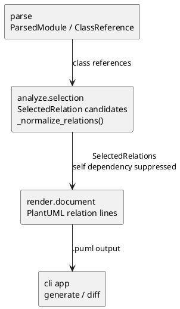

# iss-00042 Suppress Self Dependency Relations — 設計

## 目的・制約

`dependency` relation の出力強化後に実プロダクト図で観測された `A ..> A` を、図の可読性を損なう self dashed relation ノイズとして抑制する。

この issue では `dependency` の PlantUML 表記、CLI option、設定 schema、型用途と runtime 用途の細分類は変更しない。pyclassuml の外部 CLI、読み取り専用、AST 静的解析のみという前提も変更しない。

## 既存実装の理解

- `select_classes_and_relations()` が parse / traversal 結果から `SelectedRelation` 候補を集める。
- `direct_class_call`、`direct_class_member_access`、`type_check_dependency`、`cast_dependency`、`local_annotation_dependency` は `dependency` relation 候補として扱われる。
- `_normalize_relations()` は同一 triple の evidence 優先度と同一 endpoint の relation 種別優先度を決め、最終的な `SelectedRelations` を返す。
- `generate` と `diff` は共通の selection 結果を描画するため、selection 層で suppression すれば両コマンドへ同じ policy が適用される。
- `src/pyclassuml/render/document.py` は `dependency` を `..>` として描画するだけであり、今回の意味論を render 層へ移す必要はない。

## 採用方針

`_normalize_relations()` の入口で、`relation_type in {"dependency", "uses"}` かつ `source_class_id == target_class_id` の候補を除外する。

この位置を採用する理由:

- parse 層の reference 抽出仕様を複雑化しない。
- render 直前の見た目だけの除外ではなく、selection 結果と render 入力の relation 集合を一致させられる。
- `generate` / `diff` の共通経路に適用できる。
- 既存の non-self dependency / uses、association、composition、aggregation、inherits、realizes の semantics を変更しない。

採用しない案:

- render 層で `A ..> A` の行だけ捨てる案は、analysis 結果と描画結果の不一致を生みやすいため採用しない。
- classmethod return、annotation、factory call など原因別に parse 層で抑える案は、仕様と実装の分岐が増えるため採用しない。
- type-only / runtime dependency の分類はこの issue の対象外とする。

## モジュール依存図



## インターフェース契約

- public CLI:
  - 変更しない。
- model contract:
  - `SelectedRelation` の型や relation type enum 相当の値は変更しない。
- selection contract:
  - `dependency` / `uses` の self relation は `SelectedRelations.relations` に含めない。
  - non-self dependency / uses は従来通り endpoint / evidence 優先度に従って残す。
- diagnostics:
  - self dependency suppression は正常なノイズ除去として扱い、新規 warning / error は出さない。

## ディレクトリ / ファイル変更計画

```text
.
|-- src/
|   `-- pyclassuml/
|       `-- analyze/
|           `-- selection.py            # 変更: self dashed relation を正規化時に除外
`-- tests/
    |-- analyze/
    |   `-- test_selection.py           # 変更: self dependency suppression と non-self 維持を確認
    `-- app/
        |-- test_generate.py            # 変更: generate 出力で self dependency が出ないことを確認
        `-- test_diff.py                # 変更: diff 出力で同じ policy が適用されることを確認
```

## 要件 → 設計マッピング

- AC-001:
  - `_normalize_relations()` で `dependency` / `uses` self relation を除外する。
- AC-002:
  - 除外条件を `dependency` かつ `source == target` に限定し、non-self dependency tests を維持・追加する。
- AC-003:
  - selection 層で policy を適用し、app-level の `generate` / `diff` tests で `.puml` 出力を確認する。
- EC-001:
  - `dependency` / `uses` 以外の relation は今回の新規仕様化対象外とし、除外条件に含めない。
- EC-002:
  - evidence kind の分類は変更せず、self endpoint だけで判定する。

## テスト戦略

- 単体:
  - `tests/analyze/test_selection.py` に、同一 class 参照が `SelectedRelations` に残らないことと、同じ fixture 内の non-self dependency が残ることを確認する test を追加する。
- アプリケーション:
  - `tests/app/test_generate.py` で generate の `.puml` relation lines を確認する。
  - `tests/app/test_diff.py` で diff の `.puml` relation lines を確認する。
- 手動:
  - 今回は自動 test で generate / diff の policy を閉じるため、追加の手動 PlantUML 確認は必須にしない。

## リスク

- 自己 factory や recursive な設計意図を dependency として見たい利用者には情報が減る可能性がある。
- ただし class diagram の構造理解では `A ..> A` が読者に与える追加情報は小さく、今回の目的では可読性改善を優先する。

## 未確定事項

なし。
